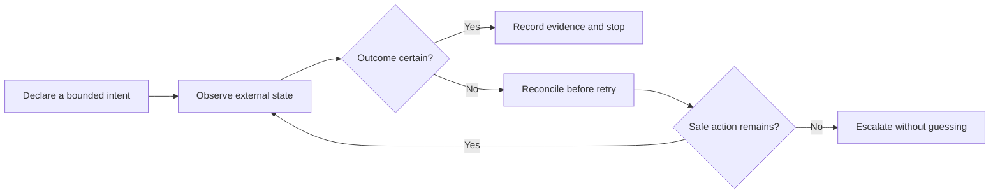

# Automation Reliability Case Studies

[](https://github.com/Jnapier2/automation-reliability-case-studies/actions/workflows/ci.yml)

Three engineering analyses of controllers that operate across unreliable
system boundaries. Each study specifies authoritative state, evidence
requirements, bounded recovery, stopping conditions, and audit records. The
scenarios are synthetic, and the repository contains no deployable integrations.

## Study map

| Case study | System boundary | Reliability focus |
| --- | --- | --- |
| Ambiguous-write reconciliation | Remote exchange APIs | Idempotent intent, reconciliation, and postcondition checks |
| Compute-worker supervision | Local process lifecycle | Identity-bound supervision, health evidence, and bounded recovery |
| Authorized-media transfer | Authenticated remote transfer | Transfer resilience, integrity staging, and hang detection |

## Case studies

- [Ambiguous-write reconciliation in exchange automation](docs/exchange-automation-reconciliation.md)
- [Identity-bound compute-worker supervision](docs/compute-worker-supervision.md)
- [Authorized-media transfer resilience](docs/authorized-media-transfer-resilience.md)



## Engineering principles

- Separating an intended action from evidence that it occurred
- Defining recovery policies with attempt, time, and authority boundaries
- Tying process ownership to identity rather than an executable name alone
- Basing health decisions on fresh evidence instead of process existence alone
- Designing audit records to explain why an action was taken or withheld
- Handling uncertainty with explicit, fail-closed stopping states

## Scope and safety boundary

This repository is documentation only. It does **not** include source code,
executables, operational commands, service endpoints, authentication flows,
credentials, trading prices or quantities, strategy parameters, wallet or pool
configuration, launchers, private filesystem paths, or third-party media.

The exchange material is not financial advice and cannot place or manage an
order. The compute material cannot start a miner or worker. The media material
cannot retrieve content. Any future implementation must undergo its own legal,
security, safety, and platform-policy review.

## Review method

Each case study is organized around four questions:

1. Which state is authoritative at each decision point?
2. What evidence is required before the controller acts again?
3. Which recovery actions are permitted, and when must they stop?
4. How can an operator reconstruct the decision after the fact?

Validation is described through synthetic scenarios and invariants rather than
live integrations. This keeps the reasoning reproducible and the safety
properties explicit.

## Validation

```bash
python -m unittest discover -s tests -v
```

The checks enforce strict UTF-8, resolve every local Markdown link, and verify
the stated scope and evidence boundaries.

## Evidence and limitations

The analyses use explicit invariants and synthetic failure scenarios. These
studies do not claim production use, platform endorsement, profitability,
trading performance, regulatory approval, or implementation of the proposed
safeguards in any external system. Each design still requires
implementation-specific threat modeling and tests.

## Status and rights

These case studies are design analyses, not deployment guides or maintained
software products. See [LICENSE.md](LICENSE.md) and
[SECURITY.md](SECURITY.md).
