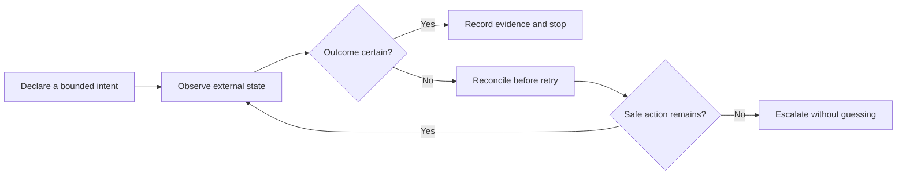

# Automation Reliability Case Studies

[](https://github.com/Jnapier2/automation-reliability-case-studies/actions/workflows/ci.yml)

Documentation-only engineering case studies on how local controllers should
behave when external systems are slow, ambiguous, or partially unavailable.
Synthetic scenarios and explicit invariants make state ownership,
reconciliation, bounded recovery, auditability, and safe stopping reviewable
without exposing an operational system.

## Study map

| Source context | Case-study treatment | Reliability focus |
| --- | --- | --- |
| Event-contract exchange automation | Consolidated detailed analysis | Ambiguous-write reconciliation, idempotent intent, and postcondition checks |
| Digital-asset exchange automation | Synthetic comparative assessment | Reliability risks and review questions across remote financial systems |
| Local compute-worker supervision | Consolidated detailed analysis | Identity-bound supervision, health evidence, and bounded recovery |
| Authorized-media transfer | Standalone detailed analysis | Transfer resilience, integrity staging, and hang detection |

The studies consolidate related systems around the reusable control patterns
they illuminate. They make no claim that every source system implements every
safeguard described in the comparative analysis.

## Case studies

- [Ambiguous-write reconciliation in exchange automation](docs/exchange-automation-reconciliation.md)
- [Identity-bound compute-worker supervision](docs/compute-worker-supervision.md)
- [Authorized-media transfer resilience](docs/authorized-media-transfer-resilience.md)



## Engineering principles

- Separating an intended action from evidence that it occurred
- Defining recovery policies with attempt, time, and authority boundaries
- Tying process ownership to identity rather than an executable name alone
- Basing health decisions on fresh evidence instead of process existence alone
- Designing audit records to explain why an action was taken or withheld
- Handling uncertainty with explicit, fail-closed stopping states

## Scope and safety boundary

This repository is documentation only. It does **not** include source code,
executables, operational commands, service endpoints, authentication flows,
credentials, trading prices or quantities, strategy parameters, wallet or pool
configuration, launchers, private filesystem paths, or third-party media.

The exchange material is not financial advice and cannot place or manage an
order. The compute material cannot start a miner or worker. The media material
cannot retrieve content. Any future implementation must undergo its own legal,
security, safety, and platform-policy review.

## Review method

Each case study is organized around four questions:

1. Which state is authoritative at each decision point?
2. What evidence is required before the controller acts again?
3. Which recovery actions are permitted, and when must they stop?
4. How can an operator reconstruct the decision after the fact?

Validation is described through synthetic scenarios and invariants rather than
live integrations. This keeps the reasoning reproducible and the safety
properties explicit.

## Validation

```bash
python -m unittest discover -s tests -v
```

The checks enforce strict UTF-8, resolve every local Markdown link, and verify
the stated scope and evidence boundaries.

## Evidence and limitations

These studies demonstrate a structured reliability-review method grounded in
completed local automation work and synthetic scenarios. They do not claim
production use, platform endorsement, profitability, trading performance,
regulatory approval, or uniform implementation of the proposed safeguards.
Each design still requires implementation-specific threat modeling and tests.

## Status and rights

These case studies are complete design analyses, not deployment guides or
maintained software products. See [LICENSE.md](LICENSE.md) and
[SECURITY.md](SECURITY.md).
