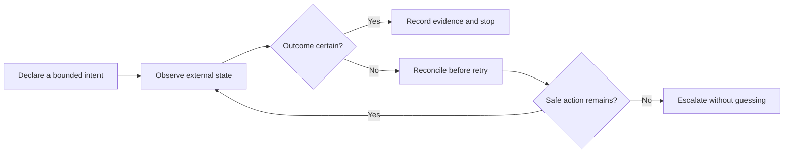

# Automation Reliability Case Studies

Architecture and assurance notes from a private portfolio of twelve automation
build records, edited into safe, non-operational case studies. Five builds
support the detailed studies below; seven additional exchange-automation builds
are represented through an inventory-level, synthetic reliability assessment.

The original work explored a common engineering question: how should a local
controller behave when the external system is slow, ambiguous, or partially
unavailable? The public material focuses on state ownership, reconciliation,
bounded recovery, auditability, and safe stopping. Operational details are
intentionally excluded.

## Portfolio scope

| Private portfolio evidence | Public treatment | Supported public focus |
| --- | --- | --- |
| Two event-contract exchange builds | Detailed consolidated case study | Ambiguous-write reconciliation, idempotent intent, and postcondition checks |
| Seven digital-asset exchange builds spanning Coinbase, Kraken, and Binance.US environments | Synthetic cross-portfolio assessment | Reliability risks and review questions that apply across remote financial systems |
| Two local compute-worker builds | Detailed consolidated case study | Identity-bound supervision, health evidence, and bounded recovery |
| One authorized-media transfer build | Detailed standalone case study | Transfer resilience, integrity staging, and hang detection |

Related builds are intentionally consolidated because their strongest public
value is the reliability pattern they illuminate, not their operational
configuration. The seven additional exchange records establish breadth of
project experience; they do not, by themselves, establish that every private
implementation contains every safeguard described in the synthetic assessment.

## Case studies

- [Ambiguous-write reconciliation in exchange automation](docs/exchange-automation-reconciliation.md)
- [Identity-bound compute-worker supervision](docs/compute-worker-supervision.md)
- [Authorized-media transfer resilience](docs/authorized-media-transfer-resilience.md)

## What the public analysis demonstrates

- Separating an intended action from evidence that it occurred
- Defining recovery policies with attempt, time, and authority boundaries
- Tying process ownership to identity rather than an executable name alone
- Basing health decisions on fresh evidence instead of process existence alone
- Designing audit records to explain why an action was taken or withheld
- Handling uncertainty with explicit, fail-closed stopping states

## Publication boundary

This repository is documentation only. It does **not** include source code,
executables, operational commands, service endpoints, authentication flows,
credentials, trading prices or quantities, strategy parameters, wallet or pool
configuration, launchers, private filesystem paths, or third-party media.

The exchange material is not financial advice and cannot place or manage an
order. The compute material cannot start a miner or worker. The media material
cannot retrieve content. Any future implementation must undergo its own legal,
security, safety, and platform-policy review.

## Review method

Each case study is organized around four questions:

1. Which state is authoritative at each decision point?
2. What evidence is required before the controller acts again?
3. Which recovery actions are permitted, and when must they stop?
4. How can an operator reconstruct the decision after the fact?

Validation is described through synthetic scenarios and invariants rather than
live integrations. This makes the reasoning reviewable without exposing a
usable operational system.

## Evidence boundary

This portfolio supports three narrow claims: the private inventory includes
twelve automation build records; seven exchange-automation records concern
Coinbase, Kraken, or Binance.US environments; and the published material
demonstrates a structured reliability-review method. It does not claim
production use, platform endorsement, profitability, trading performance,
regulatory approval, or uniform implementation of the proposed safeguards
across every private build.

## Status and rights

The underlying builds are held privately. These public summaries are finished
portfolio artifacts, not maintained products or deployment guides. See
[LICENSE.md](LICENSE.md) and [SECURITY.md](SECURITY.md).
