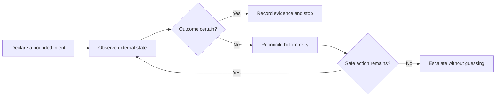

# Automation Reliability Case Studies

Architecture and assurance notes from five completed automation builds, edited
into safe, non-operational portfolio case studies.

The original work explored a common engineering question: how should a local
controller behave when the external system is slow, ambiguous, or partially
unavailable? The public material focuses on state ownership, reconciliation,
bounded recovery, auditability, and safe stopping. Operational details are
intentionally excluded.

## Portfolio scope

| Original build | Public treatment | Engineering focus |
| --- | --- | --- |
| Kalshi Buy Bot | Consolidated case study | Ambiguous-write reconciliation and idempotent intent |
| Kalshi Sell Bot | Consolidated case study | Exposure-safe state transitions and postcondition checks |
| Alpha Monero Solo Miner | Consolidated case study | Identity-bound worker supervision and bounded recovery |
| GPU Mining Alpha 5090 | Consolidated case study | Exact process ownership, health evidence, and escalation limits |
| Vdownloader | Standalone case study | Authorized-media transfer resilience and hang detection |

Two pairs are intentionally consolidated because their strongest public value
is the reliability pattern they share, not their operational configuration.

## Case studies

- [Ambiguous-write reconciliation in exchange automation](docs/exchange-automation-reconciliation.md)
- [Identity-bound compute-worker supervision](docs/compute-worker-supervision.md)
- [Authorized-media transfer resilience](docs/authorized-media-transfer-resilience.md)

## What this demonstrates

- Controllers that distinguish an intended action from proof that it occurred
- Recovery policies with explicit attempt, time, and authority boundaries
- Process ownership tied to identity rather than a convenient executable name
- Health decisions based on fresh evidence instead of process existence alone
- Audit records designed to explain why an action was taken or withheld
- Safety-first handling of uncertainty, including fail-closed stopping states

## Publication boundary

This repository is documentation only. It does **not** include source code,
executables, operational commands, service endpoints, authentication flows,
credentials, trading prices or quantities, strategy parameters, wallet or pool
configuration, launchers, private filesystem paths, or third-party media.

The exchange material is not financial advice and cannot place or manage an
order. The compute material cannot start a miner or worker. The media material
cannot retrieve content. Any future implementation must undergo its own legal,
security, safety, and platform-policy review.

## Review method

Each case study is organized around four questions:

1. Which state is authoritative at each decision point?
2. What evidence is required before the controller acts again?
3. Which recovery actions are permitted, and when must they stop?
4. How can an operator reconstruct the decision after the fact?

Validation is described through synthetic scenarios and invariants rather than
live integrations. This makes the reasoning reviewable without exposing a
usable operational system.

## Status and rights

The underlying builds are held privately. These public summaries are finished
portfolio artifacts, not maintained products or deployment guides. See
[LICENSE.md](LICENSE.md) and [SECURITY.md](SECURITY.md).
