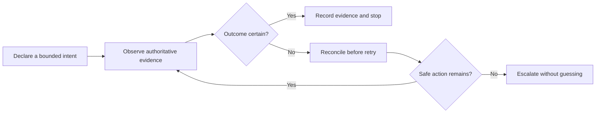

# Automation Reliability Case Studies

[](https://github.com/Jnapier2/automation-reliability-case-studies/actions/workflows/ci.yml)

Nine engineering analyses of controllers operating across unreliable system
boundaries. Each study shows how authoritative state, evidence requirements,
bounded recovery, stopping conditions, and audit records can limit duplicate
actions, runaway retries, and decisions that cannot be reconstructed after the
fact.

Six named showcase studies are informed by verified working/save-state or
fail-closed private projects: Gateway CKPool 5090 Miner, multi-exchange crypto
spread bots, Kalshi Weather Ladder, Kalshi 1¢ Buy and 2¢ Sell automation,
Gateway AI Network Guard, and MUDD Game Development — Second Chances. Their
public scenarios are synthetic and intentionally exclude deployable
integrations, credentials, private configuration, live strategies, machine
details, copyrighted game assets, and operational commands.

Before retrying, each controller reconciles external state to establish what
happened and whether a safe action remains.

## Study map

| Case study | System boundary | Reliability focus |
| --- | --- | --- |
| Ambiguous-write reconciliation | Remote exchange APIs | Idempotent intent, reconciliation, and postcondition checks |
| Compute-worker supervision | Local process lifecycle | Identity-bound supervision, health evidence, and bounded recovery |
| Authorized-media transfer | Authenticated remote transfer | Transfer resilience, integrity staging, and hang detection |
| GPU mining readiness | Local GPU worker and remote progress evidence | Package identity, evidence health, duplicate-launch prevention, and bounded recovery |
| Multi-exchange crypto spread bots | Remote crypto exchange state | Freshness, fee-aware planning, queue integrity, ambiguous-write reconciliation, and inventory truth |
| Prediction-market data quality | Forecast and exchange evidence | Degradation visibility, dry-run parity, exposure limits, and write separation |
| Prediction-market save-state reconciliation | Package, field installation, platform prerequisites, and exchange evidence | Sealed-package authority, correlation completeness, reversible cleanup, and performance-evidence limits |
| Local network guard | Local telemetry and optional operator response | Read-only collection, evidence confidence, advisory labels, and reversible action boundaries |
| Game release acceptance | Source, player, and handoff artifacts | Exact-artifact completeness, clean-extraction launch proof, and fail-closed promotion |

## Case studies

- [Ambiguous-write reconciliation in exchange automation](docs/exchange-automation-reconciliation.md)
- [Identity-bound compute-worker supervision](docs/compute-worker-supervision.md)
- [Authorized-media transfer resilience](docs/authorized-media-transfer-resilience.md)
- [GPU mining readiness and bounded recovery](docs/gpu-mining-readiness.md)
- [Multi-exchange crypto spread-bot reliability](docs/crypto-spread-bot-reliability.md)
- [Prediction-market data quality and write guardrails](docs/prediction-market-data-quality.md)
- [Prediction-market save-state reconciliation](docs/prediction-market-save-state-reconciliation.md)
- [Local network guard evidence and bounded response](docs/local-network-guard-evidence.md)
- [Game release acceptance and fail-closed promotion](docs/release-acceptance-fail-closed.md)


```mermaid
flowchart LR
    A["Declare a bounded intent"] --> B["Observe authoritative evidence"]
    B --> C{"Outcome certain?"}
    C -- "Yes" --> D["Record evidence and stop"]
    C -- "No" --> E["Reconcile before retry"]
    E --> F{"Safe action remains?"}
    F -- "Yes" --> B
    F -- "No" --> G["Escalate without guessing"]
```

## Engineering principles

- Separating an intended action from evidence that it occurred
- Defining recovery policies with attempt, time, and authority boundaries
- Tying process ownership to identity rather than an executable name alone
- Basing health decisions on fresh evidence instead of process existence alone
- Separating a healthy runtime from a degraded evidence or reporting surface
- Preserving sealed-package authority when a field installation contains extra files
- Keeping dry-run planning and live planning on one reviewable decision path
- Making optional-data degradation visible rather than silently substituting it
- Preserving independent computer operation without ownership or lease gates
- Designing audit records to explain why an action was taken or withheld
- Requiring every release artifact before making a promotion claim
- Handling uncertainty with explicit, fail-closed stopping states

## Scope and safety boundary

This repository is documentation only. It does **not** include source code,
executables, operational commands, service endpoints, authentication flows,
credentials, trading prices or quantities, strategy parameters, wallet or pool
configuration, mining settings, local network identifiers, firewall rules,
launchers, private filesystem paths, copyrighted game assets, or third-party
media.

The exchange and prediction-market material is not financial advice and cannot
place or manage an order. The mining material cannot start, configure, tune, or
stop a miner. The network-guard material cannot scan a real network or apply a
containment action. The media material cannot retrieve content. The release-
acceptance material cannot build or distribute the private game. Any future
implementation must undergo its own legal, security, safety, rights, and
platform-policy review.

## Review method

Each case study is organized around four questions:

1. Which state is authoritative at each decision point?
2. What evidence is required before the controller acts again?
3. Which recovery actions are permitted, and when must they stop?
4. How can an operator reconstruct the decision after the fact?

Validation is described through synthetic scenarios and invariants rather than
live integrations. This keeps the reasoning reproducible and the safety
properties explicit.

## Sanitization method

The named showcase studies retain only high-level provenance: project identity,
working/save-state or fail-closed classification, version lineage, verification
class, and reusable reliability lessons. They exclude package bytes, private
hashes, Drive identifiers, user paths, local addresses, wallets, credentials,
order details, strategy thresholds, pool settings, tuning values, copyrighted
game assets, and security exceptions.

Automated checks require every named showcase to state its evidence source and
public boundary. They also reject common credential markers, private-key
headers, personal Windows paths, raw network addresses, private Drive links,
private package digests, and assignment-style operational secrets.

## Validation

```bash
python -m unittest discover -s tests -v
```

The checks enforce strict UTF-8, resolve every local Markdown link, verify the
stated scope and evidence boundaries, and scan the named showcases for sensitive
or operational residue.

## Evidence and limitations

The analyses use explicit invariants and synthetic failure scenarios. Working,
save-state, or fail-closed provenance supports the relevance of each study; it
does not make the private package public and does not prove that every proposed
control is implemented exactly as described.

These studies do not claim production safety, platform endorsement,
profitability, trading performance, mining performance, regulatory approval,
security certification, successful game acceptance, or implementation of the
proposed safeguards in any external system. Each design still requires
implementation-specific threat modeling and tests.

## Status and rights

These case studies are design analyses, not deployment guides or maintained
software products. See [LICENSE.md](LICENSE.md) and
[SECURITY.md](SECURITY.md).

[Portfolio](https://jerry-napier-portfolio.netlify.app/) · [GitHub profile](https://github.com/Jnapier2)

Copyright © 2026 Gateway Information Group LLC. All rights reserved.
