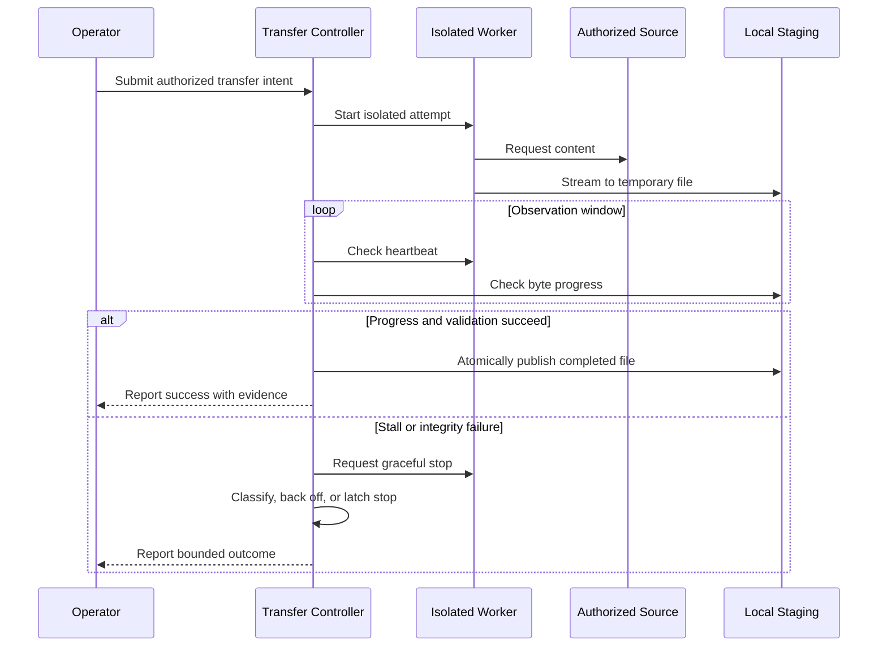

# Authorized-Media Transfer Resilience and Watchdogs

## Case-study context

A local video-transfer utility provided the design context for recovering from
slow or stalled network transfers while maintaining file integrity and operator
control. This case study focuses on the resilience design rather than an
operational downloader.

The system is described for media the operator owns or is explicitly permitted
to retrieve. This document provides no downloader, extraction logic, service
endpoint, bypass technique, authentication method, launch command, or copied
media.

## Reliability problem

Network activity can continue without useful progress, and a stalled transfer
can look superficially alive. Retrying too aggressively wastes bandwidth and
may create duplicate or corrupted output. A safe controller needs independent
progress observation, conservative retry classification, and atomic publication
of validated files.

## Watchdog design

The controller observes the worker from outside its execution context. A
heartbeat shows that control flow is responsive; file-size and timestamp
changes show that useful transfer progress continues. Neither signal alone is
sufficient.

A stall is confirmed only after a policy-defined observation window and a
second sample. The watchdog then requests graceful cancellation, waits for
cleanup, and verifies the owned worker exited. Forced termination is a bounded
last resort for the verified worker process only.

## Staging and integrity

Output remains under a temporary staging name until validation confirms:

- Nonzero, stable size after the worker closes the file
- Expected container signature rather than extension alone
- Complete stream termination and no pending writer handle
- Optional checksum agreement when an authoritative digest is available
- Collision-safe destination naming
- Atomic promotion from staging to final destination

An interrupted or invalid file is never presented as complete. Existing files
are not overwritten implicitly.

## Retry classification

| Classification | Example evidence | Controller response |
| --- | --- | --- |
| Transient | Connection reset with prior progress | Back off and resume or restart if policy allows |
| Stalled | Heartbeat present but no byte progress | Cancel owned attempt, retain diagnostics, bounded retry |
| Integrity failure | Final validation rejects staged file | Quarantine staging artifact; do not publish |
| Authorization failure | Source denies access | Stop; do not attempt a bypass |
| Unsupported source | Transfer contract cannot be established | Fail clearly and request a supported, authorized input |
| Operator cancellation | Explicit local stop request | Stop promptly, clean staging safely, report partial state |
| Repeated failure | Recovery budget exhausted | Latch stop and require a new operator decision |

## Safeguards

- Accept only operator-supplied, authorized sources.
- Do not circumvent access controls, paywalls, authentication, or DRM.
- Run each transfer attempt in an isolated, identity-bound worker.
- Require both liveness and progress evidence.
- Bound retries, total elapsed time, and forced-stop escalation.
- Use temporary staging and atomic publication after validation.
- Preserve existing destination files unless replacement is explicitly approved.
- Redact query strings and sensitive headers from logs.
- Keep cancellation responsive and report whether partial data was retained.
- Separate user-facing outcomes from diagnostic detail.

## Failure modes and responses

| Failure mode | Risk | Safe response |
| --- | --- | --- |
| Worker alive but transfer stalled | Indefinite hang | Independent progress watchdog and bounded cancellation |
| Partial file appears complete | User consumes corrupt output | Stage privately; publish only after validation |
| Retry creates duplicates | Storage clutter or ambiguity | Stable intent identity and collision-safe naming |
| Destination already exists | Accidental overwrite | Compare evidence and require explicit replacement policy |
| Log captures a signed URL | Credential disclosure | Redact sensitive URL components before persistence |
| Cancellation leaves worker | Resource leak | Verify owned process exit; bounded escalation |
| Source denies access | Unauthorized workaround | Stop without bypass attempts |
| Repeated transient failures | Retry storm | Backoff, persistent attempt budget, latched stop |

## Validation approach

Testing uses a synthetic local source that can delay, disconnect, truncate,
misreport type, repeat content, and ignore cancellation. No third-party media is
required. The validation matrix checks that:

- Normal transfers publish exactly one validated output.
- Slow but advancing transfers are not misclassified as stalled.
- A confirmed stall triggers bounded cancellation and no final publication.
- Truncated or type-mismatched content remains quarantined.
- Repeated failures reach a persistent stop rather than an infinite loop.
- Operator cancellation produces a prompt, auditable outcome.
- Sensitive URL components never appear in persisted logs.
- Existing destination files remain unchanged under collision scenarios.

## Non-operational scope

This case study cannot download or transform media. It includes no source code,
commands, service-specific behavior, or bypass capability. It is an engineering
review of transfer reliability for lawful, authorized use only.
