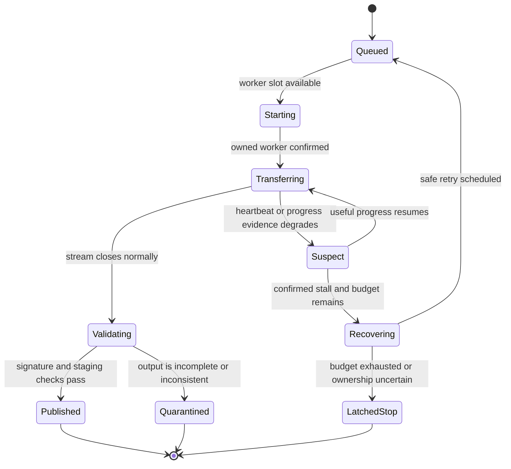

# Recoverable Authorized-Media Queue Delivery

## Evidence source

This public case study is informed by the user-confirmed working/save-state
lineage of **Vdownloader Video-Only v6.12.18**. The private evidence records a
stable canonical launcher, project-local outputs, runtime-identity checks, a
ready startup state, and a bounded support export that passed archive integrity
validation.

Those facts establish that the private project reached a reviewed operating
state. They do not make its package, site-specific behavior, configuration,
download history, or private evidence public.

## Showcase objective

The engineering problem is how to execute a recoverable queue of authorized
media transfers without presenting partial files as complete, losing operator
intent after a restart, or turning one stalled worker into an unbounded retry
loop.

The public design separates five questions:

1. Is the requested source inside the authorized-use boundary?
2. Is the queued intent durable and uniquely identifiable?
3. Is the worker alive and making useful progress?
4. Is the staged output structurally valid?
5. Can the result be published once without overwriting unrelated data?

## Reliability invariants

- The queue is durable before a worker starts.
- One queue item can own at most one active worker.
- Heartbeat evidence and byte-progress evidence are evaluated separately.
- A temporary file is never represented as a completed result.
- Retries are bounded by attempt count, elapsed time, and failure class.
- Restart recovery reconciles staged files and prior intent before starting new
  work.
- Relative destinations resolve from the project root rather than the caller's
  working directory.
- Existing destination files are preserved unless replacement is explicit.
- Support evidence is bounded, redacted, project-local, and reviewable.
- Authorization failure stops the intent rather than triggering a bypass path.

```mermaid
stateDiagram-v2
    [*] --> Queued
    Queued --> Starting: worker slot available
    Starting --> Transferring: owned worker confirmed
    Transferring --> Validating: stream closes normally
    Transferring --> Suspect: heartbeat or progress evidence degrades
    Suspect --> Transferring: useful progress resumes
    Suspect --> Recovering: confirmed stall and budget remains
    Recovering --> Queued: safe retry scheduled
    Recovering --> LatchedStop: budget exhausted or ownership uncertain
    Validating --> Published: signature and staging checks pass
    Validating --> Quarantined: output is incomplete or inconsistent
    Published --> [*]
    Quarantined --> [*]
    LatchedStop --> [*]
```

## Synthetic scenarios

| Scenario | Required response |
| --- | --- |
| Worker heartbeat continues but staged bytes stop changing | Enter suspect state, confirm the stall, then apply bounded cancellation |
| Staged bytes grow slowly but consistently | Preserve the worker and avoid a false timeout |
| Controller restarts with unfinished queue items | Reconcile durable intent and staging before launching another worker |
| Two workers claim the same item | Preserve one verified owner and stop the conflicting attempt |
| Output extension looks valid but the signature does not | Quarantine the staged file and report an integrity failure |
| Destination already contains a file with the requested name | Apply collision-safe naming or require explicit replacement |
| Source rejects access | Stop without attempting to circumvent access controls |
| Support export cannot safely include one item | Record the omission and preserve the remaining minimum recovery evidence |

## Audit evidence

A reviewable record contains queue-item identity, authorization classification,
worker creation evidence, heartbeat freshness, progress freshness, attempt
budget, staged-output state, validation result, destination decision, operator
cancellation state, and the reason the controller published, retried,
quarantined, or stopped.

A public demonstration can use a synthetic local source that delays, truncates,
disconnects, repeats data, or ignores cancellation. It should prove that each
intent produces at most one published result and that incomplete outputs remain
private.

## Public boundary

This document contains no downloader source, executable, service endpoint,
browser profile, authentication material, private configuration, download
history, media file, site rule, bypass technique, launch command, private path,
or support-export content. It cannot retrieve, transform, or publish media.

The private Vdownloader package and its evidence remain owner-only. The public
material is limited to queue, watchdog, staging, recovery, and audit design for
lawful authorized use.

## Limitations

This case study does not claim compatibility with any external service,
production safety, transfer performance, legal permission for a particular
source, or implementation parity with every private-project feature. Any
operational downloader still requires source-specific legal review, dependency
validation, native Windows testing, endpoint-protection review, and exact
package acceptance.

Copyright © 2026 Gateway Information Group LLC. All rights reserved.
