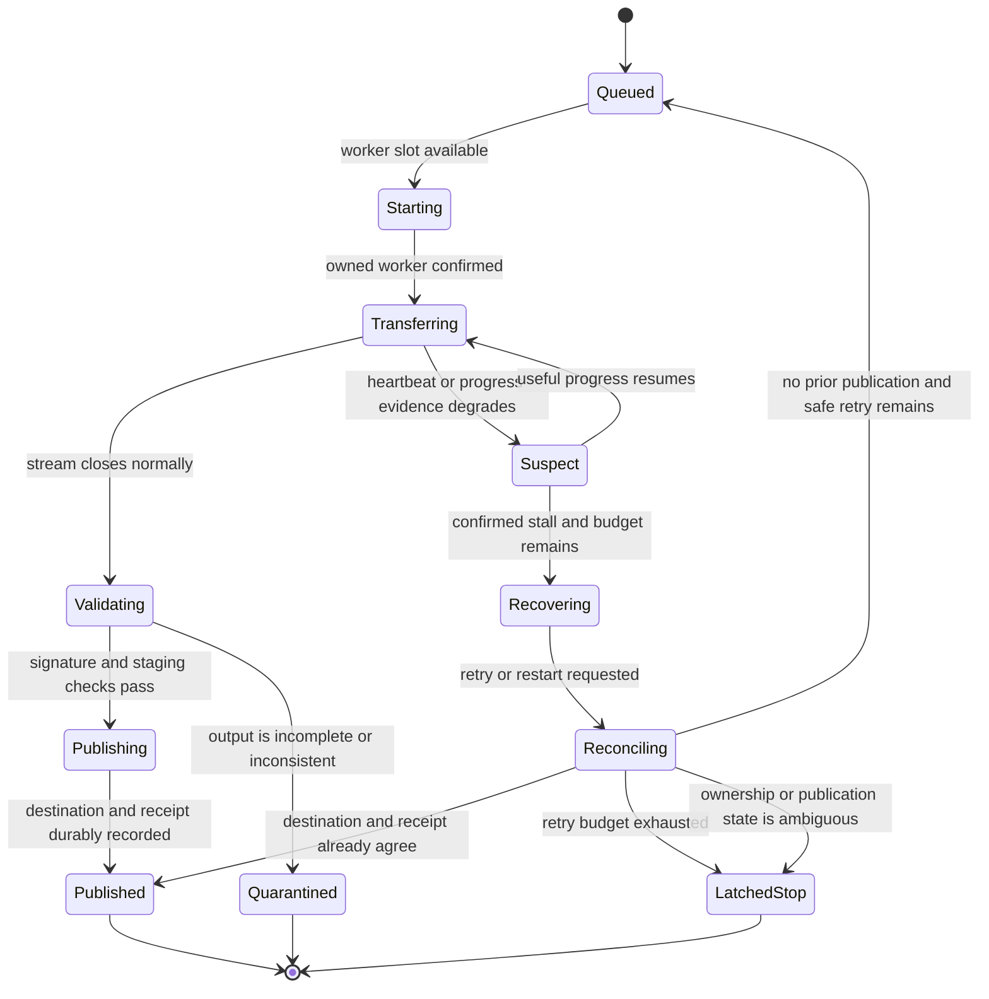

# Recoverable Authorized-Media Queue Delivery

## Evidence source

This public case study is informed by the user-confirmed working/save-state
lineage of **Vdownloader Video-Only v6.12.18**. The private evidence records a
stable canonical launcher, project-local outputs, runtime-identity checks, a
ready startup state, and a bounded support export that passed archive integrity
validation.

Those facts establish that the private project reached a reviewed operating
state. They do not make its package, site-specific behavior, configuration,
download history, or private evidence public.

## Showcase objective

The engineering problem is how to execute a recoverable queue of authorized
media transfers without presenting partial files as complete, losing operator
intent after a restart, publishing the same intent twice, or turning one stalled
worker into an unbounded retry loop.

The public design separates six questions:

1. Is the requested source inside the authorized-use boundary?
2. Is the queued intent durable and uniquely identifiable?
3. Is the worker alive and making useful progress?
4. Is the staged output structurally valid?
5. Can the result be published once without overwriting unrelated data?
6. Can restart recovery prove whether publication already completed before it
   starts another worker?

## Reliability invariants

- The queue is durable before a worker starts.
- One queue item can own at most one active worker.
- Heartbeat evidence and byte-progress evidence are evaluated separately.
- A temporary file is never represented as a completed result.
- Retries are bounded by attempt count, elapsed time, and failure class.
- Publication uses a deterministic destination identity and a durable
  publication receipt tied to the queue-item identity.
- Restart recovery reconciles durable intent, staging, the expected destination,
  and any publication receipt before relaunching another worker.
- A destination that already matches the durable receipt is adopted as the
  completed result rather than copied or renamed again.
- The final destination and its publication receipt are made durable before the
  queue item is acknowledged complete.
- Relative destinations resolve from the project root rather than the caller's
  working directory.
- Existing unrelated destination files are preserved unless replacement is
  explicit.
- Support evidence is bounded, redacted, project-local, and reviewable.
- Authorization failure stops the intent rather than triggering a bypass path.

```mermaid
stateDiagram-v2
    [*] --> Queued
    Queued --> Starting: worker slot available
    Starting --> Transferring: owned worker confirmed
    Transferring --> Validating: stream closes normally
    Transferring --> Suspect: heartbeat or progress evidence degrades
    Suspect --> Transferring: useful progress resumes
    Suspect --> Recovering: confirmed stall and budget remains
    Recovering --> Reconciling: retry or restart requested
    Reconciling --> Published: destination and receipt already agree
    Reconciling --> Queued: no prior publication and safe retry remains
    Reconciling --> LatchedStop: retry budget exhausted
    Reconciling --> LatchedStop: ownership or publication state is ambiguous
    Validating --> Publishing: signature and staging checks pass
    Validating --> Quarantined: output is incomplete or inconsistent
    Publishing --> Published: destination and receipt durably recorded
    Published --> [*]
    Quarantined --> [*]
    LatchedStop --> [*]
```

## Synthetic scenarios

| Scenario | Required response |
| --- | --- |
| Worker heartbeat continues but staged bytes stop changing | Enter suspect state, confirm the stall, then apply bounded cancellation |
| Staged bytes grow slowly but consistently | Preserve the worker and avoid a false timeout |
| Controller restarts with unfinished queue items | Reconcile durable intent, staging, deterministic destination identity, and publication receipt before launching another worker |
| Process crashes after the destination is published but before queue completion is recorded | Verify the destination against the durable publication receipt, adopt it as complete, and do not relaunch or create a second copy |
| Retry or elapsed-time budget expires with no prior publication | Transition to `LatchedStop` and require operator review rather than starting another attempt |
| Destination exists but no valid receipt or deterministic identity can prove ownership | Latch safe and require operator review instead of guessing or overwriting |
| Two workers claim the same item | Preserve one verified owner and stop the conflicting attempt |
| Output extension looks valid but the signature does not | Quarantine the staged file and report an integrity failure |
| Destination already contains an unrelated file with the requested name | Apply collision-safe naming or require explicit replacement before publication |
| Source rejects access | Stop without attempting to circumvent access controls |
| Support export cannot safely include one item | Record the omission and preserve the remaining minimum recovery evidence |

## Audit evidence

A reviewable record contains queue-item identity, authorization classification,
worker creation evidence, heartbeat freshness, progress freshness, attempt
budget, staged-output state, validation result, deterministic destination
identity, publication receipt, destination verification, operator cancellation
state, exhausted-budget state, and the reason the controller published, adopted
an existing publication, retried, quarantined, or stopped.

A public demonstration can use a synthetic local source that delays, truncates,
disconnects, repeats data, ignores cancellation, or crashes at each publication
boundary. It should prove that each durable intent produces at most one published
result, including when a crash occurs after destination publication but before
queue completion, that an exhausted budget always reaches a stopping state, and
that incomplete outputs remain private.

## Public boundary

This document contains no downloader source, executable, service endpoint,
browser profile, authentication material, private configuration, download
history, media file, site rule, bypass technique, launch command, private path,
or support-export content. It cannot retrieve, transform, or publish media.

The private Vdownloader package and its evidence remain owner-only. The public
material is limited to queue, watchdog, staging, publication-receipt, recovery,
and audit design for lawful authorized use.

## Limitations

This case study does not claim compatibility with any external service,
production safety, transfer performance, legal permission for a particular
source, or implementation parity with every private-project feature. Any
operational downloader still requires source-specific legal review, dependency
validation, native Windows testing, endpoint-protection review, crash-window,
retry-budget and filesystem-durability testing, and exact package acceptance.

Copyright © 2026 Gateway Information Group LLC. All rights reserved.
