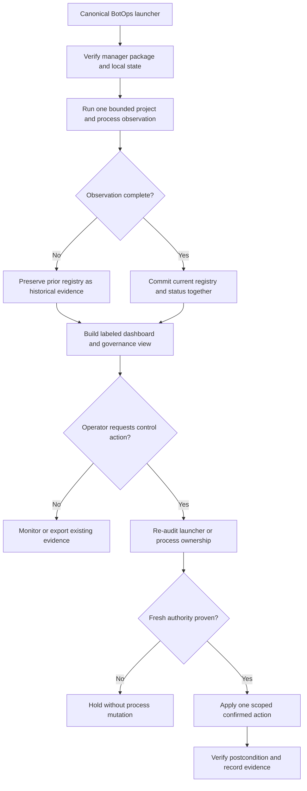

# BotOps Manager: Control-Plane Cohesion and Bounded Process Authority

## Evidence source

This public case study is informed by three separately preserved private BotOps
Manager states:

- v1.23.3 is the user-confirmed Windows control rollback baseline.
- v1.25.0 is the Windows scan-accepted foundation save state. Its field
  evidence records a successful live status scan across 31 registered projects,
  managed runtime identity, and healthy local database checks, while explicitly
  noting that a full live preflight and verified child start/stop cycle were not
  captured.
- v1.25.1, build `BOTOPS-1.25.1-20260828-WINSYNC1`, is the current
  synchronization and hardening candidate. It repairs a 31-versus-26
  registry/dashboard evidence split without introducing a second Windows
  process scan.

The v1.25.1 candidate passed 252 source tests, the same 252 tests from a fresh
exact extraction, 57 strict release-verifier checks, 22 managed-identity checks,
a deterministic rebuild, an unrelated-working-directory startup check, an
interprocess-exclusion foundation self-test, a coherent synthetic scan/export
smoke test, and negative tamper gates. Those results qualify the engineering
study; they do not promote the candidate over its preserved Windows save state
and rollback.

## Showcase objective

An operations console can make independently launched automation easier to
understand, but it becomes dangerous when discovery, dashboard cache, process
ownership, and control decisions disagree. The design objective is to give an
operator one coherent view without turning a local manager into an unrestricted
process controller.

BotOps separates discovery evidence, presentation state, health interpretation,
launch authority, stop authority, and support export. A cached dashboard is not
allowed to outrank the latest validated registry and process observation, and a
persisted process identifier is never sufficient proof of ownership by itself.

## Reliability invariants

- One canonical manager launcher owns the supported operator entrypoint.
- Each visible manager action maps to one authoritative implementation.
- Discovery, current status, dashboard, and governance views derive from the
  same completed observation whenever possible.
- An incomplete scan does not silently erase the prior registry; retained rows
  are labeled historical rather than freshly observed.
- A cached dashboard count cannot overrule a newer validated registry/status
  count.
- Rebuilding a presentation view reuses already collected evidence instead of
  starting a redundant process scan.
- Start authority requires a freshly re-audited, project-scoped launcher.
- Stop authority requires verified process identity and manager ownership, not
  an executable name or persisted process identifier alone.
- Externally started processes remain monitor-only by default.
- Duplicate manager instances cannot perform conflicting writes to the same
  project-local state.
- Interprocess-lock probes are bounded and clean up their contender process.
- Child credentials, private configuration, and application logic remain
  outside the manager's inspection boundary.
- Support export is read-only, redacted, size-bounded, archive-tested, and
  derived from existing local evidence.
- Missing, stale, or contradictory evidence produces a visible hold rather than
  guessed process control.
- Candidate status remains separate from Windows save-state and confirmed
  rollback authority.

## Synthetic scenarios

| Scenario | Required response |
| --- | --- |
| Registry and latest status contain 31 projects while cached dashboard data contains 26 | Rebuild the presentation view from the already collected current evidence; do not launch a second process scan merely to refresh the dashboard |
| A directory scan stops early | Preserve the previous registry as historical evidence and make the incomplete observation visible |
| A persisted process identifier now belongs to another process | Refuse control because identifier reuse breaks ownership proof |
| Two manager instances attempt to update the same state | Permit one bounded writer and fail the conflicting update without corrupting the registry |
| A child project exposes only a stale log | Report degraded health evidence; do not infer that the process is healthy or dead |
| An unsafe setup, build, cleanup, or broad-stop script resembles a launcher | Exclude it from automatic start selection and require an explicit supported action |
| A start request targets a launcher that changed since discovery | Re-audit the current file and refuse the stale discovery result |
| A manager-started process exits during the settle window | Do not record durable ownership or claim a successful start |
| Support export sees stale presentation counts | Record the drift and use a safe registry-backed view without changing child projects |
| The candidate passes build-host tests but lacks a verified Windows control cycle | Keep candidate, save-state, and rollback classifications separate |

## Audit evidence

A reviewable manager record contains the manager package identity, observation
run identity, scan completeness, registry version, status timestamp,
presentation source, launcher audit result, process identity evidence, ownership
basis, requested action, confirmation state, postcondition, lock outcome,
export result, and final disposition.

A public demonstration can use generated project folders, inert launchers, and
mock process inventories. It should prove that stale presentation data cannot
become control authority, incomplete scans do not masquerade as current truth,
and process reuse cannot turn a historical identifier into permission to stop a
new process.

## Public boundary

This document contains no private BotOps source package, project registry,
process identifier, computer name, user path, child-project path, credential,
private configuration, launcher body, stop command, support export, database,
log body, private package digest, or operational automation source. It cannot
discover, launch, stop, restart, or modify a real process or project.

The private v1.25.1 candidate, v1.25.0 Windows scan-accepted foundation save
state, v1.23.3 confirmed control rollback, and their evidence remain owner-only.

## Limitations

This is a reliability and process-governance case study, not a released process
manager. The current candidate still requires its exact full Windows preflight,
one disposable low-risk verified child start/stop cycle, and normal endpoint-
protection acceptance before it can replace v1.25.0 as the scan-accepted
foundation or v1.23.3 as the confirmed control rollback. Real process
enumeration, permissions, job objects, terminal behavior, child health
contracts, and operating-system differences require implementation-specific
testing.

Copyright © 2026 Gateway Information Group LLC. All rights reserved.
