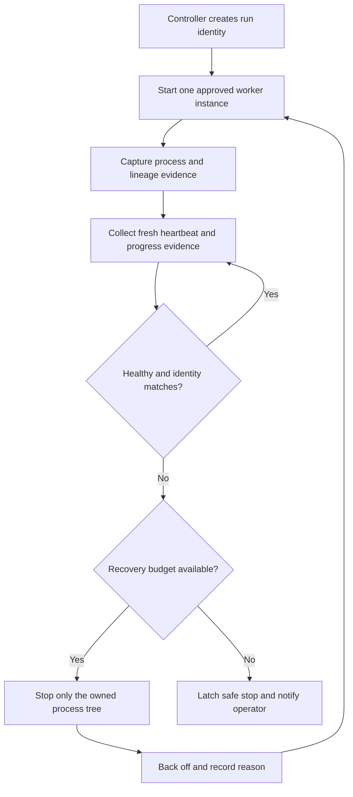
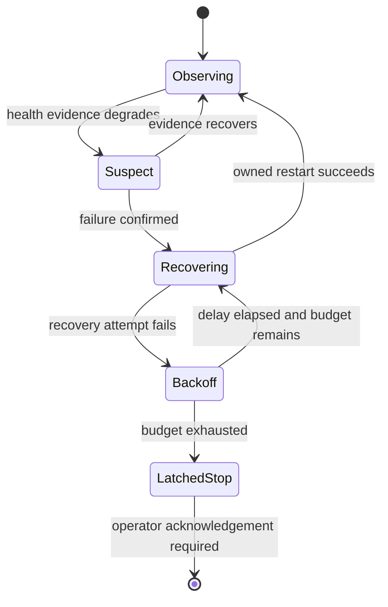

# Identity-Bound Compute-Worker Supervision

## Case-study context

Two private compute-automation builds supervised long-running workers on local
hardware. Their public engineering value is the control-plane pattern: prove
which process belongs to the controller, judge health from fresh evidence, and
limit recovery so the supervisor cannot become a restart loop.

This synthetic description contains no worker software, executable, wallet,
pool, endpoint, command line, launch script, payout information, or hardware
tuning value.

## Reliability problem

An executable name is not a safe ownership boundary. Several processes can
share a name, a worker can spawn children, and an unrelated user process may be
running at the same time. A supervisor that terminates by name can affect the
wrong workload. Likewise, a running process is not necessarily a healthy one.

## Identity and ownership model

The controller assigns each run an opaque identity and records evidence at
launch. A process is considered owned only when the recorded evidence agrees:

- Expected executable fingerprint or approved artifact identity
- Exact process identifier and creation time
- Parent-child lineage rooted in the controller's launch
- Run-specific marker supplied through a non-secret local channel
- Expected working context without relying on a private absolute path

If identity evidence is missing, stale, or contradictory, the controller may
observe the process but must not terminate it.

## Health model

Health combines several signals rather than treating process existence as
success: recent monotonic heartbeats, current progress evidence, reasonable
resource behavior, parseable status, and a continuing identity match. Signals
are evaluated with hysteresis so a transient pause does not immediately cause a
restart. Missing evidence produces an **unknown** state, not an automatic
failure verdict.

## Bounded recovery

The policy limits attempts across a rolling period, increases delay after
repeated failure, and persists through controller restarts. Exhaustion latches a
stop that requires operator acknowledgement; restarting the supervisor does not
reset the budget.

## Safeguards

- Observe-only mode is available for commissioning and diagnosis.
- Termination requires complete ownership evidence for the exact process tree.
- Unrelated same-name processes are never adopted or stopped automatically.
- Unknown health blocks destructive recovery until more evidence arrives.
- Graceful stop precedes forced termination, with each outcome recorded.
- Backoff includes jitter and an attempt budget to prevent tight loops.
- Recovery state persists so a supervisor restart cannot erase the budget.
- A latched stop preserves diagnostic evidence for operator review.
- No worker artifact or privileged persistence mechanism is bundled.

## Failure modes and responses

| Failure mode | Risk | Safe response |
| --- | --- | --- |
| Same-name unrelated process | Wrong process terminated | Require launch lineage and artifact identity |
| Process identifier reused | Stale ownership match | Pair identifier with creation evidence and run identity |
| Worker alive but stalled | Silent loss of progress | Evaluate heartbeat and progress freshness |
| Telemetry temporarily missing | Unnecessary restart | Enter unknown/suspect state and wait within policy |
| Repeated crash after launch | Restart storm | Persistent budget, increasing backoff, latched stop |
| Controller restarts | Lost ownership or budget | Reload durable run and recovery evidence |
| Child process survives | Orphaned workload | Stop only the verified owned process tree and verify exit |
| Forced termination fails | Unbounded escalation | Record failure, latch stop, require operator action |

## Validation approach

A synthetic worker harness can emit controlled heartbeats, progress markers,
child processes, stalls, crashes, and misleading same-name processes. The test
environment uses inert placeholder workloads.

Validation establishes that:

- Every destructive action is preceded by a successful ownership proof.
- An unrelated same-name process survives every scenario.
- A stale process identifier cannot satisfy the identity predicate.
- Transient telemetry loss does not consume the recovery budget.
- Repeated confirmed failures eventually reach a persistent latched stop.
- Restarting the controller preserves ownership and recovery history.
- Audit records reconstruct the signal, decision, action, and result.
- Observe-only mode produces no process-control side effects.

## Non-operational scope

This repository cannot start, configure, tune, or supervise a real miner or
compute worker. It includes no operational software or configuration and makes
no claim about profitability or suitability. The material documents a general
reliability pattern only.
