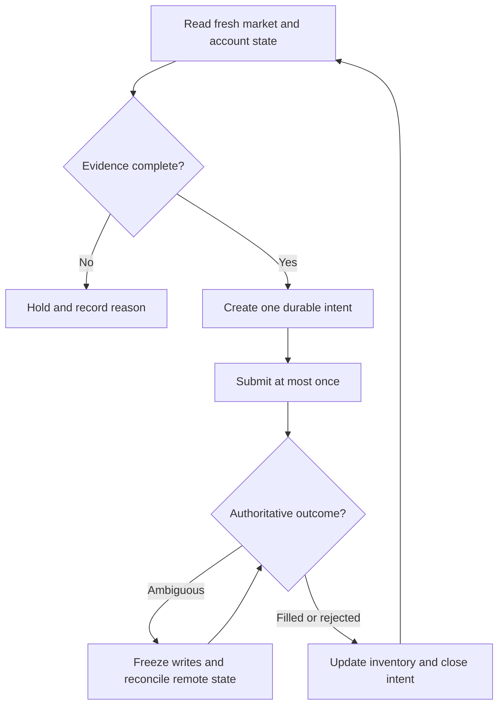

# Multi-Exchange Crypto Spread-Bot Reliability

## Evidence source

This public case study is informed by three owner-operated working/save-state
lineages:

- **Kraken Multi SpreadBot r332-v2.17.6** as the current known-good line, with
  r333 retained as a candidate and r321 as a previous known-good baseline.
- **Coinbase Spot SpreadBot R312.1** as the current known-good line, with a
  separately held R312.2 candidate and an older R311.8 rollback.
- **BinanceUS Multi SpreadBot R307** as the current known-good line, with R308
  retained as an offline candidate.

The private records include checksum-backed packages, Windows-working evidence,
health-profile checks, and explicit current/candidate/rollback separation. This
showcase publishes the reliability model only. It does not publish operational
source, venue credentials, symbols, order parameters, or private strategies.

## Showcase objective

A spread controller crosses several uncertain boundaries at once: market-data
freshness, fee and precision rules, local state, remote order state, and process
restart recovery. A safe controller must prevent one uncertain write or stale
observation from becoming a duplicate order or an unexplained inventory change.

## Reliability invariants

- Every potential write begins as a durable intent with a unique local identity.
- Market data must satisfy freshness and completeness checks before it can
  support a decision.
- Estimated outcomes include fees, rounding, precision, and available depth;
  gross spread alone is not authoritative.
- An ambiguous submit or cancel blocks another write until remote state is
  reconciled.
- Partial fills update inventory and remaining intent before another action is
  considered.
- Duplicate workers cannot own the same account-and-strategy scope.
- Per-market limits, aggregate inventory limits, and loss guardrails fail
  closed when required state is missing.
- Restart recovery begins with read-only reconciliation, not automatic order
  resubmission.

## Synthetic scenarios

| Scenario | Required response |
| --- | --- |
| Submit response is lost after the venue may have accepted it | Mark ambiguous and reconcile before any retry |
| Order book is stale or incomplete | Refuse the decision and preserve the prior state |
| A partial fill arrives during cancellation | Reconcile fill, remaining quantity, and inventory before another action |
| Local process restarts with an open intent | Resume read-only reconciliation from durable state |
| Two controller instances start | Permit one owner and place the other in observe-only conflict state |
| Fee or precision metadata is unavailable | Treat net outcome as unknown and block the write |
| Venue reports several plausible matching orders | Escalate; do not guess which action belongs to the intent |
| Inventory differs from the local ledger | Freeze new writes until the discrepancy is explained |

## Audit evidence

The minimum audit trail records market-data freshness, account-state freshness,
intent identity, preconditions, estimated net outcome class, remote correlation
evidence, order-state transitions, fill reconciliation, inventory changes,
guardrail results, and the reason an action was taken or withheld.

A public demonstration can use a deterministic exchange simulator that injects
stale books, lost responses, partial fills, cancel races, and process restarts.
The key property is not profitability; it is that one durable intent cannot
silently create two externally effective actions.

## Public boundary

This document contains no exchange endpoint, account identifier, API key,
private key, symbol list, price, quantity, fee schedule, spread threshold,
selection rule, inventory target, profit objective, order command, or live-write
implementation. It cannot authenticate, calculate a trade, submit an order, or
manage funds.

The named private projects remain owner-only. Candidate versions remain
unpromoted until their native Windows, dependency, endpoint-protection,
authenticated read-only, and project-specific acceptance gates are complete.

## Limitations

This is not financial advice, a trading strategy, a performance claim, or a
deployment guide. Exchange behavior varies, and any implementation requires its
own legal, security, platform, and operational review.

Copyright © 2026 Gateway Information Group LLC. All rights reserved.
