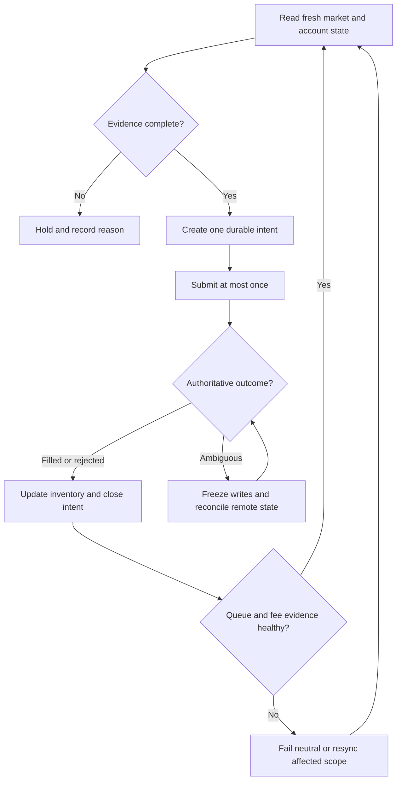

# Multi-Exchange Crypto Spread-Bot Reliability

## Evidence source

This public case study is informed by three owner-operated working/save-state
lineages current as of August 25, 2026:

- **Kraken Multi SpreadBot r338-v2.17.10** as the current Windows-working
  baseline.
- **Coinbase Multi-Asset Spread Bot R312.4** as the current known-good line.
- **Binance.US Multi-Spread Bot R314** as the current known-good rollback and
  save-state baseline.

The private evidence includes exact package identities, Windows-working
confirmation, managed-file checks, complete regression suites, healthy runtime
rosters, authenticated-feed evidence, project-local support exports, and
explicit current/candidate/rollback separation.

The latest reviews also preserve important uncertainty rather than hiding it:
an exported source-context copy can be over-redacted without invalidating the
installed runtime; queue-integrity failures can require per-market resync;
insufficient-funds churn and private-rate waits can consume operational
capacity; and a cold fee-net scorecard cannot justify a ranking preference.

This showcase publishes the reliability model only. It does not publish
operational source, venue credentials, symbols, order parameters, private
strategies, or account-specific economics.

## Showcase objective

A spread controller crosses several uncertain boundaries at once: market-data
freshness, fee and precision rules, local state, remote order state, export
fidelity, and process restart recovery. A safe controller must prevent one
uncertain write, stale observation, or misleading support artifact from becoming
a duplicate order or an unexplained inventory change.

## Reliability invariants

- Every potential write begins as a durable intent with a unique local identity.
- Market data must satisfy freshness and completeness checks before it can
  support a decision.
- Estimated outcomes include fees, rounding, precision, and available depth;
  gross spread alone is not authoritative.
- A cold or incomplete scorecard remains neutral and cannot boost thin evidence.
- An ambiguous submit or cancel blocks another write until remote state is
  reconciled.
- Partial fills update inventory and remaining intent before another action is
  considered.
- Per-market queue-integrity failure places only the affected scope into
  fail-neutral or resync-required state.
- Duplicate workers cannot own the same account-and-strategy scope.
- Per-market limits, aggregate inventory limits, and loss guardrails fail
  closed when required state is missing.
- Rate-budget exhaustion stops before send rather than turning delay into an
  unbounded retry.
- Support-export fidelity is evaluated separately from installed runtime
  identity.
- Restart recovery begins with read-only reconciliation, not automatic order
  resubmission.
- Current safe-state evidence outranks stale pre-confirmation wording embedded
  in historical diagnostics.

## Synthetic scenarios

| Scenario | Required response |
| --- | --- |
| Submit response is lost after the venue may have accepted it | Mark ambiguous and reconcile before any retry |
| Order book is stale or incomplete | Refuse the decision and preserve the prior state |
| A partial fill arrives during cancellation | Reconcile fill, remaining quantity, and inventory before another action |
| Local process restarts with an open intent | Resume read-only reconciliation from durable state |
| Two controller instances start | Permit one owner and place the other in observe-only conflict state |
| Fee or precision metadata is unavailable | Treat net outcome as unknown and block the write |
| Queue evidence fails integrity for one market | Fail neutral for that scope and require a fresh resync |
| Balance is insufficient for a planned action | Stop the write and avoid amend/retry churn |
| Private-rate wait exceeds its budget | Stop before send and record the deferred refresh |
| Support export changes executable source through redaction | Mark the export non-runnable while preserving the verified installed-runtime result |
| Venue reports several plausible matching orders | Escalate; do not guess which action belongs to the intent |
| Inventory differs from the local ledger | Freeze new writes until the discrepancy is explained |
| Scorecard has no completed cycle | Keep evidence-qualified preference neutral |

## Audit evidence

The minimum audit trail records market-data freshness, account-state freshness,
intent identity, preconditions, estimated net-outcome class, remote correlation
evidence, order-state transitions, fill reconciliation, inventory changes,
queue-integrity state, rate-budget outcome, support-export fidelity, guardrail
results, and the reason an action was taken or withheld.

A public demonstration can use a deterministic exchange simulator that injects
stale books, lost responses, partial fills, cancel races, insufficient balances,
rate waits, queue corruption, export redaction, and process restarts. The key
property is not profitability; it is that one durable intent cannot silently
create two externally effective actions.

## Public boundary

This document contains no exchange endpoint, account identifier, API key,
private key, symbol list, price, quantity, fee schedule, spread threshold,
selection rule, inventory target, profit objective, order command, or live-write
implementation. It cannot authenticate, calculate a trade, submit an order, or
manage funds.

The named private projects remain owner-only. Candidate versions remain
unpromoted until their native Windows, dependency, endpoint-protection,
authenticated read-only, and project-specific acceptance gates are complete.

## Limitations

This is not financial advice, a trading strategy, a performance claim, or a
deployment guide. Exchange behavior varies, and any implementation requires its
own legal, security, platform, and operational review.

Copyright © 2026 Gateway Information Group LLC. All rights reserved.
