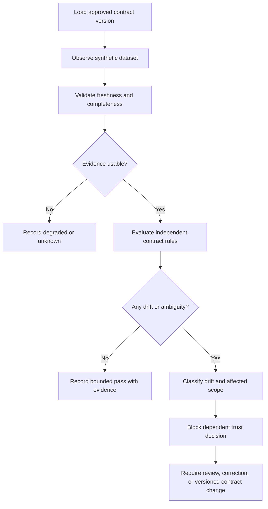

# Data Contract Monitor: Fail-Closed Contract Drift Governance

## Evidence source

This public case study is informed by the current **Data Contract Monitor
v0.1.5** public source and release, which passed release identity across 124
managed files, 75 automated tests, Windows and Linux hosted validation, the real
composite Action workflow, release construction, and CodeQL. The earlier private
**v0.1.2** user-confirmed Windows working/save-state package remains a distinct
field rollback rather than the current public source authority.

That evidence supports the relevance of this study. It does not publish the
private rollback package, contract definitions, production data, local paths,
diagnostic records, or organization-specific policy.

## Showcase objective

The engineering problem is how to decide whether observed data is safe to use
when its schema, freshness, keys, values, sensitivity, or delivery behavior can
drift from an approved contract.

The monitor separates the approved contract from observations. It classifies
each rule independently, explains the affected data and downstream risk, and
fails closed when evidence is missing or ambiguous instead of rewriting the
contract from whatever arrived most recently.

## Reliability invariants

- A contract has a stable identity, explicit version, owner, effective date, and
  review state.
- Observed data cannot silently redefine the approved contract.
- Freshness, completeness, schema, type, nullability, uniqueness, range,
  reference, and sensitivity rules are evaluated separately.
- Missing evidence is reported as unknown or degraded rather than passed.
- One clean sample cannot erase an unresolved prior drift incident.
- Contract changes require a reviewable proposal and cannot be inferred from a
  single observation.
- Rule results preserve the contract version and observation identity used for
  the decision.
- Downstream impact is reported separately from rule severity.
- Enforcement remains bounded; a public demonstration cannot modify production
  data or a production contract.
- Evidence generation is deterministic, redacted, and suitable for review.
- A new package or rule set cannot replace the accepted baseline without its
  own verification and rollback evidence.

## Synthetic scenarios

| Scenario | Required response |
| --- | --- |
| A required field disappears | Record schema drift and identify dependent checks that cannot run |
| A field keeps its name but changes type | Classify incompatible type drift and block dependent trust |
| Duplicate business keys appear | Record uniqueness failure with bounded sample evidence |
| Delivery arrives after the freshness limit | Report stale evidence rather than a clean result |
| A new sensitive field appears without review | Flag an unreviewed sensitivity change and require governance review |
| A value falls outside an approved range | Record the violated rule and affected scope without rewriting the range |
| One partition is missing | Report incomplete evidence and withhold a complete-dataset pass |
| The next run is clean after a severe unresolved failure | Preserve incident history until the resolution is reviewed |
| A proposed contract version removes a rule | Keep the current contract authoritative until approval is recorded |
| A candidate package reports green but lacks native acceptance | Preserve the working/save-state baseline and keep the candidate unpromoted |

## Audit evidence

A reviewable record contains contract identity and version, observation identity,
collection time, freshness, evaluated rule set, result by rule, skipped checks,
degraded evidence, affected fields and rows, downstream impact, proposed
resolution, reviewer state, package lifecycle, and the reason the overall result
is pass, drift, degraded, unknown, or blocked.

A public demonstration can use deterministic synthetic tables that add, remove,
rename, duplicate, delay, or corrupt fields. It should prove that a failed or
ambiguous rule cannot be converted into a green result by omission, retry, or
automatic contract mutation.

## Public boundary

This document contains no private dataset, customer or employee record,
production contract, service endpoint, credential, connection string, private
path, package digest, Drive identifier, or operational enforcement command. It
cannot inspect a private source, change a production schema, quarantine real
records, or approve a contract.

The private working/save-state rollback package and its evidence remain
owner-only. The public material is limited to contract identity, drift
classification, evidence quality, impact explanation, review state, and
fail-closed decision design.

## Limitations

This case study does not claim production data quality, regulatory compliance,
platform certification, automated remediation safety, or implementation parity
with every private-project feature. Any operational implementation still
requires organization-specific contract ownership, privacy and security review,
current source integration tests, native acceptance, rollback testing, and
approved enforcement policy.

Copyright © 2026 Gateway Information Group LLC. All rights reserved.
