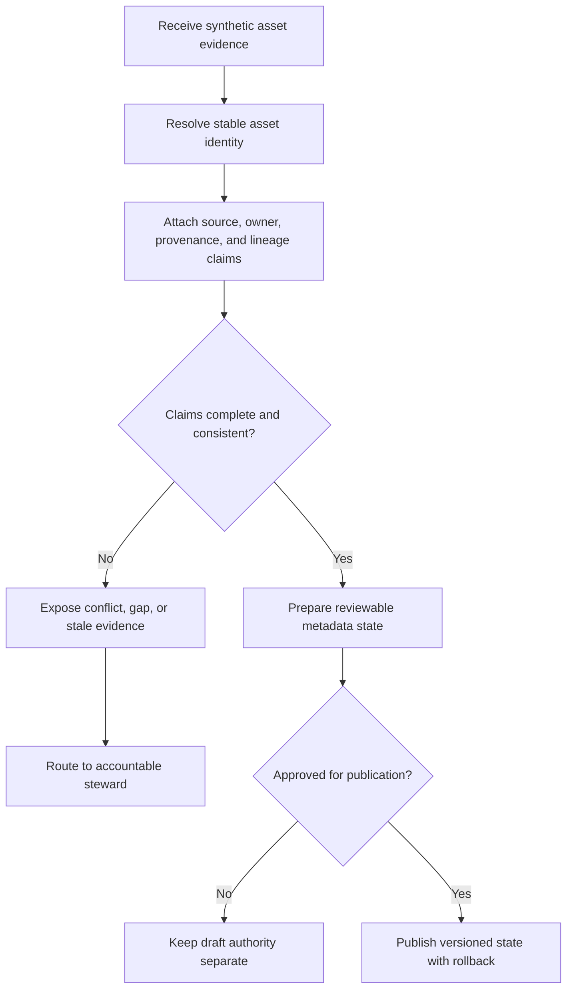

# Data Governance and Lineage Portal: Reviewable Provenance Decisions

## Evidence source

This public case study is informed by the **Data Governance & Lineage Portal
v0.2.1** verified maintenance known-good baseline, with **v0.2.0** preserved as
the field-confirmed Windows rollback. The private evidence records stable release
identity, bounded maintenance hardening, verified asset behavior, and a distinct
rollback line.

The evidence supports this reliability analysis. It does not publish the private
portal package, catalog contents, organization-specific ownership records,
production lineage, local paths, diagnostics, or deployment configuration.

## Showcase objective

The engineering problem is how to help people understand what a data asset
means, who is accountable for it, where it came from, what depends on it, and
whether the available evidence is strong enough to support a decision.

The portal treats asset identity, names, ownership, provenance, lineage, quality,
policy, and stewardship as related but distinct evidence. Conflicts remain
visible. A convenient label cannot silently replace a stable asset identity, and
one incomplete lineage observation cannot be presented as complete provenance.

## Reliability invariants

- Each asset has a stable identity that survives display-name changes.
- Names, aliases, owners, classifications, and lifecycle states retain their
  sources and effective dates.
- Provenance and lineage edges state direction, source, confidence, and review
  status.
- Conflicting ownership or lineage claims remain visible until reviewed.
- Missing lineage is unknown, not automatically absent.
- A downstream impact view distinguishes confirmed, inferred, stale, and
  unsupported relationships.
- Publication and approval are explicit states; draft metadata cannot silently
  become authoritative.
- Rollback preserves the prior accepted metadata state and its evidence.
- Search results cannot create or mutate governance authority.
- Maintenance work cannot mix managed files from incompatible releases.
- Public demonstrations use synthetic assets and cannot connect to a private
  catalog or publish production metadata.
- Diagnostic and export evidence remains bounded and excludes private records.

## Synthetic scenarios

| Scenario | Required response |
| --- | --- |
| An asset is renamed | Preserve stable identity and retain the old name as an alias when supported |
| Two systems claim different owners | Show the conflict and require stewardship review |
| A lineage edge lacks a trustworthy source | Classify it as inferred or unknown rather than confirmed |
| A source system is stale | Mark affected provenance and downstream impact as stale |
| A field is removed upstream | Identify confirmed downstream dependencies and separate uncertain ones |
| A duplicate record appears under a different name | Require evidence before merge; do not collapse identity from similarity alone |
| A draft policy tag is added | Keep it non-authoritative until approval is recorded |
| A publication partially fails | Preserve the prior accepted state and record the incomplete attempt |
| A candidate release reports new lineage | Keep the prior known-good and rollback authority until acceptance passes |
| A search returns no result | Report not found within the indexed scope; do not infer nonexistence |

## Audit evidence

A reviewable decision record contains stable asset identity, display names and
aliases, evidence sources, owners and stewards, classifications, provenance
claims, lineage edges, confidence, freshness, conflicts, affected downstream
assets, review state, publication version, rollback reference, package lifecycle,
and the reason a relationship is confirmed, inferred, stale, unknown, rejected,
or superseded.

A public demonstration can use deterministic synthetic catalogs with renamed
assets, conflicting owners, missing edges, stale sources, duplicate candidates,
and failed publication attempts. It should prove that conflicts remain visible,
stable identity is preserved, and publication cannot occur without an explicit
reviewed state.

## Public boundary

This document contains no private catalog, production schema, customer or
employee record, credential, service endpoint, connection string, private path,
package digest, Drive identifier, or metadata-write command. It cannot read a
private catalog, discover a real dependency, assign an owner, publish metadata,
or change a production policy.

The private verified maintenance known-good package and field-confirmed rollback
remain owner-only. The public material is limited to stable identity, provenance,
lineage, stewardship, confidence, impact, publication, and rollback design.

## Limitations

This case study does not claim complete lineage, governance certification,
regulatory compliance, production deployment, automated ownership accuracy, or
implementation parity with every private-project feature. Any operational portal
still requires source-specific integration review, access controls, privacy and
security assessment, stewardship policy, native acceptance, migration testing,
and independently verified rollback.

Copyright © 2026 Gateway Information Group LLC. All rights reserved.
