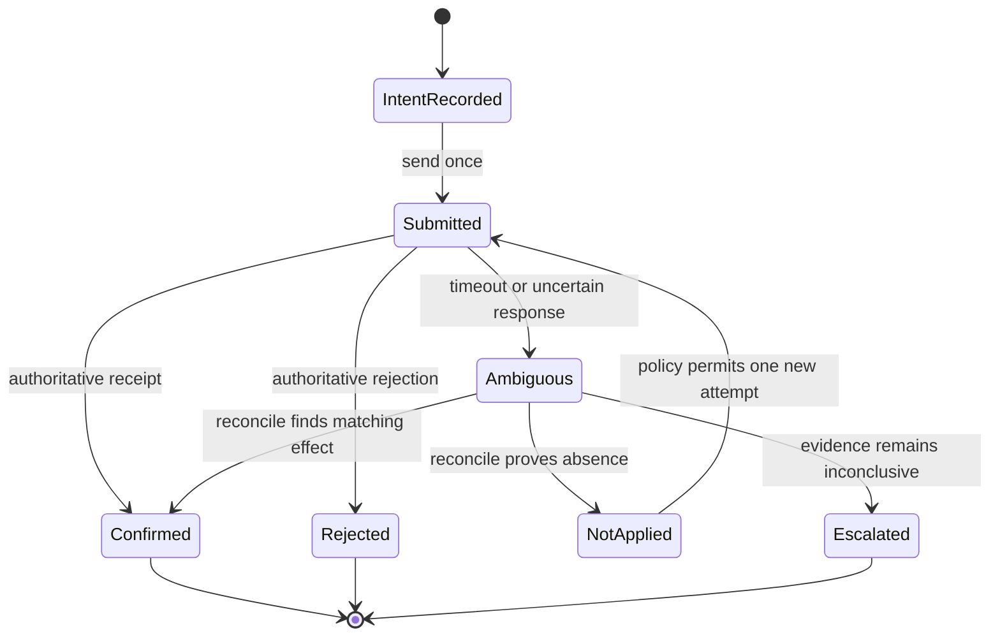

# Ambiguous-Write Reconciliation in Exchange Automation

## Case-study context

Two private exchange-automation builds handled opposite sides of an order
lifecycle. Their useful shared lesson was not a market tactic; it was how to
avoid duplicating a financial action when a remote write times out or returns an
uncertain result.

This document uses a synthetic exchange and generic intents. It contains no
live connectivity details, credentials, prices, quantities, instruments,
selection rules, or strategy parameters.

## Reliability problem

A transport failure does not prove that a requested action failed. The remote
service may have committed the write while the response was lost. Blindly
retrying can create a second order; assuming success can leave the desired
state unmet. The controller therefore needs a third outcome: **ambiguous**.

## Design pattern

### Durable intent before side effect

The controller records a locally unique intent before contacting the external
service. That record describes the requested state transition and its lifecycle
status without embedding a reusable authentication value. A retry refers to
the same intent rather than silently creating a new one.

### Evidence-ranked reconciliation

After an uncertain response, the controller pauses new writes and queries
authoritative state. Evidence is ranked from strongest to weakest:

1. A service-issued receipt tied unambiguously to the intent
2. A unique remote record matching the expected postcondition
3. A position or balance change consistent with the intent and no competing event
4. Local transport output without remote confirmation

Only strong, unambiguous evidence closes the intent as applied. A plausible but
non-unique match is treated as unresolved.

### Idempotency boundary

Idempotency is defined around the business intent, not around a network call.
The invariant is:

> At most one externally effective action may be attributed to one durable intent.

The controller cannot always guarantee external idempotency by itself, so it
combines a stable correlation identity, pre-write observation, post-write
reconciliation, and a stop state when uniqueness cannot be proven.

## Safeguards

- No write is issued without a recorded intent and an explicit operating mode.
- Ambiguous outcomes block further writes for the affected intent.
- Reconciliation reads authoritative external state before any retry decision.
- A retry is allowed only after evidence proves the prior attempt had no effect.
- Competing or non-unique matches fail closed to operator review.
- Precondition and postcondition snapshots are retained with timestamps.
- The audit trail records decisions, evidence references, and reason codes.
- Restart recovery resumes from the durable lifecycle rather than from memory.

## Failure modes and responses

| Failure mode | Risk | Safe response |
| --- | --- | --- |
| Response lost after remote commit | Duplicate action | Mark ambiguous; reconcile before considering another write |
| Stale external read | Incorrect absence proof | Require freshness evidence or wait; do not retry |
| Multiple plausible remote matches | False attribution | Escalate as unresolved |
| Local process restart | Forgotten in-flight intent | Reload durable lifecycle and reconcile |
| Clock drift | Invalid event ordering | Prefer service sequence evidence; flag unreliable local time |
| Partial response parsing | False success | Require a complete authoritative receipt |
| Concurrent operator action | Confused ownership | Detect competing state change and halt automated attribution |

## Validation approach

The design can be tested without a live exchange by using a deterministic
simulator that records synthetic writes and selectively loses responses.

| Scenario | Expected invariant |
| --- | --- |
| Write accepted and response delivered | Intent closes once with authoritative evidence |
| Write accepted and response lost | Reconciliation finds one effect; no second write occurs |
| Write rejected | Intent closes rejected; no retry without a new approved intent |
| Write not received | Absence is proven before any policy-authorized retry |
| Read view remains stale | Controller waits or escalates; it does not infer absence |
| Two plausible matches appear | Intent remains unresolved and blocks automation |
| Controller restarts mid-flight | Durable lifecycle resumes without duplicating the effect |

Additional review checks include state-transition coverage, audit-record
completeness, correlation uniqueness, clock-skew tolerance, and property tests
that assert no ambiguous state can transition directly to a new write.

## Non-operational scope

This case study cannot connect to an exchange, authenticate, select a market,
calculate an order, or execute a transaction. It is not financial advice or a
deployment specification. Implementation details that could enable live use
remain private.
