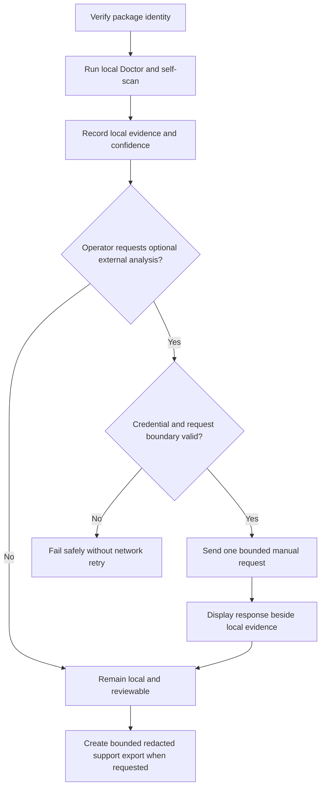

# Gateway Intelligence Core: Local Evidence Triage and Manual External-Provider Boundaries

## Evidence source

This public case study is informed by **Gateway Intelligence Core v0.1.4**, an
exact-archive-qualified Windows test candidate. The private package build label
is intentionally omitted because it contains provider-selection detail. The
reviewed package contains 56 archive entries and retains v0.1.3 as its rollback.

Candidate qualification records 91 of 91 source tests, 91 of 91 exact-extract
tests, 23 of 23 deterministic evaluations, and 54 of 54 managed-identity checks
passing. Required Doctor checks passed; the local self-scan reported ready,
Green, and zero findings; the dashboard bootstrap passed; and the acceptance
support export contained 17 bounded items and passed archive integrity. The
new candidate preserves the local-first and no-credential safety boundaries
established by the earlier line.

Field acceptance remains open for Windows double-click launch, normal
Norton/SmartScreen observation of the exact final archive, one explicit live
external-provider connectivity test on the user's Windows computer, and any
optional local-provider validation that is later claimed.

The private program, release package, provider configuration, prompts, local
findings, machine context, and support evidence remain owner-only. This study
publishes the control model, not the operational implementation.

## Showcase objective

A local intelligence and diagnostics workspace can combine self-inspection,
issue triage, evaluations, dashboards, and optional external reasoning. The
reliability problem is to keep those capabilities understandable and bounded:
local checks must remain useful without credentials, automated routines must
not create paid or external actions, and a candidate must not be promoted merely
because one dashboard or provider call succeeds.

The public design separates package identity, local observation, deterministic
evaluation, operator-visible findings, optional manual external requests, and
support export into distinct states.

## Reliability invariants

- Package identity is verified before protected or credential-bearing behavior.
- Startup, Doctor, self-scan, evaluation, crash capture, and support export do
  not contact an external reasoning provider.
- An external request can begin only through an explicit operator action.
- Missing credentials fail safely and do not trigger discovery, retries, or
  fallback network calls.
- Local evidence remains authoritative for what was observed on the computer;
  an external explanation cannot rewrite the underlying finding.
- Deterministic evaluations remain separate from live-provider behavior.
- Findings record evidence, confidence, scope, and disposition instead of
  presenting every observation as a defect.
- Dashboard readiness does not by itself qualify the complete package.
- Retries, request size, time, cost, and exported evidence are bounded.
- Credentials are read only through the approved runtime boundary and are never
  written to project files, diagnostics, or support exports.
- Support export is read-only, redacted, project-local, and integrity-tested.
- Candidate and rollback artifact identities remain permanently distinct;
  acceptance can change disposition and current authority, but never merge,
  overwrite, or relabel either identity.

## Synthetic scenarios

| Scenario | Required response |
| --- | --- |
| The program starts without provider credentials | Local Doctor, self-scan, dashboard, and evaluations remain available; no external request is attempted |
| An automatic scan discovers a warning | Record the evidence locally; do not send the warning to an external service |
| The operator requests external analysis without a valid credential | Fail safely, record a bounded local status, and do not retry across alternative endpoints |
| A provider response conflicts with local evidence | Preserve the local evidence and label the external response as interpretation rather than fact |
| Dashboard bootstrap succeeds but managed identity fails | Keep the candidate unqualified and restrict protected behavior |
| An evaluation result changes after a package update | Record the versioned evaluation delta; do not overwrite the prior result |
| A manual external request times out | Stop within the request budget and keep local operation available |
| A support export is requested after an external response | Exclude credentials, private request content, and provider metadata not required for support |
| The newer candidate passes every promotion gate | Change its disposition and current authority while preserving the rollback as a separate immutable identity |

## Audit evidence

A reviewable record contains package identity, local check name, evidence source,
collection result, finding confidence, deterministic evaluation identity,
operator action, external-request admission result, bounded request outcome,
response provenance, export result, and final candidate or rollback disposition.

A public demonstration can use synthetic health observations and a stubbed
external boundary. It should prove that automatic routines remain local, a
missing credential produces no network attempt, external interpretation cannot
mutate the evidence ledger, and the support export stays redacted and bounded.

## Public boundary

This document contains no private build label, source archive, executable,
credential, provider identity or key, request or response content, private
prompt, machine identifier, local path, network address, diagnostic finding,
support export, private package digest, or operational configuration. It cannot
inspect a real computer, authenticate to a provider, submit a paid request, or
modify a system.

The v0.1.4 candidate and v0.1.3 rollback remain owner-only and permanently
separate identities. Public material is limited to package qualification,
local-first operation, manual external-action admission, deterministic
evaluation, redaction, and rollback design.

## Limitations

This is a reliability and governance case study, not a deployed diagnostics or
security product. Provider behavior, billing, privacy terms, model quality,
network failure, native Windows behavior, endpoint-protection reputation,
accessibility, and real-world diagnostic accuracy require separate acceptance.
The candidate is not promoted to known-good until the pending Windows launch,
normal-protection, live external-provider, and other project-specific release
checks are complete.

Copyright © 2026 Gateway Information Group LLC. All rights reserved.
