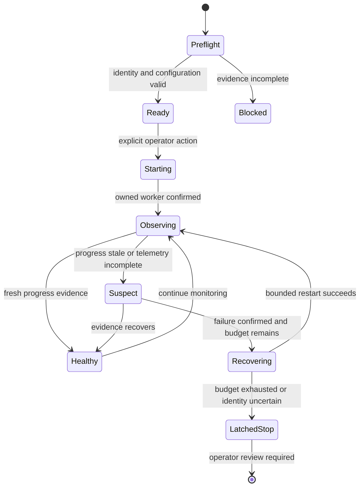

# GPU Mining Readiness and Bounded Recovery

## Evidence source

This public case study is informed by the verified working/save-state lineage of
**Gateway CKPool 5090 Miner v1.119.46**, with v1.119.43 retained as the immediate
rollback. The private evidence records a complete runtime-identity check, a
healthy active-mining state, a bounded twenty-item support export, Windows
acceptance evidence, and user confirmation.

Those facts establish that the underlying project reached a reviewed operating
state. They do not make the private package, wallet, pool settings, executable,
or performance configuration public.

## Showcase objective

The engineering problem is how to supervise a long-running GPU worker without
confusing process existence with useful progress, restarting the wrong process,
or hiding uncertainty behind a green status label.

The public design separates four questions:

1. Is the exact approved worker package running?
2. Is fresh progress evidence available?
3. Is the worker still inside its bounded operating envelope?
4. Is an automated recovery action still permitted?

## Reliability invariants

- Startup is blocked when package identity, configuration shape, or required
  runtime evidence is incomplete.
- A running process is not considered healthy without fresh progress evidence.
- Duplicate launch attempts cannot create a second owned worker.
- Recovery applies only to the process tree started by the controller.
- A restart budget survives controller restarts and eventually latches safe.
- Missing or contradictory evidence produces an unknown state rather than an
  invented success or failure result.
- Support evidence is bounded, redacted, project-local, and reviewable.

## Synthetic scenarios

| Scenario | Required response |
| --- | --- |
| Process exists but progress evidence stops | Enter suspect state; do not claim healthy |
| Controller is started twice | Reconcile the owned process and refuse a duplicate launch |
| Telemetry source becomes temporarily unavailable | Mark health unknown and preserve the recovery budget |
| Worker exits repeatedly | Apply bounded backoff, then latch safe |
| Process identifier is reused | Reject ownership unless creation and lineage evidence also match |
| Configuration is incomplete | Block startup before the worker or network path is touched |
| Recovery attempt cannot prove the old worker exited | Stop automation and require operator review |

## Audit evidence

A useful evidence record contains the run identity, package identity result,
preflight outcome, process creation evidence, progress freshness, operating
state, recovery budget, decision reason, action taken, and observed result.

The public showcase treats accepted progress evidence as a health signal, not a
profitability claim. It does not publish hashrate targets, power limits, thermal
thresholds, wallet information, pool details, or private machine identifiers.

## Public boundary

This document contains no miner executable, wallet, pool endpoint, payout data,
launch command, overclock value, voltage or power setting, local path, device
serial, network address, credential, or endpoint-protection exception. It
cannot start, configure, tune, or stop a real miner.

The scenario is synthetic and documentation-only. Any operational miner still
requires exact-package verification, hardware-specific testing, sustained-run
acceptance, endpoint-protection review, and operator approval.

## Limitations

The study does not claim profitability, pool acceptance, hardware suitability,
production safety, or independent security review. It documents a reusable
control pattern derived from a verified private save state while keeping the
operational package private.

Copyright © 2026 Gateway Information Group LLC. All rights reserved.
