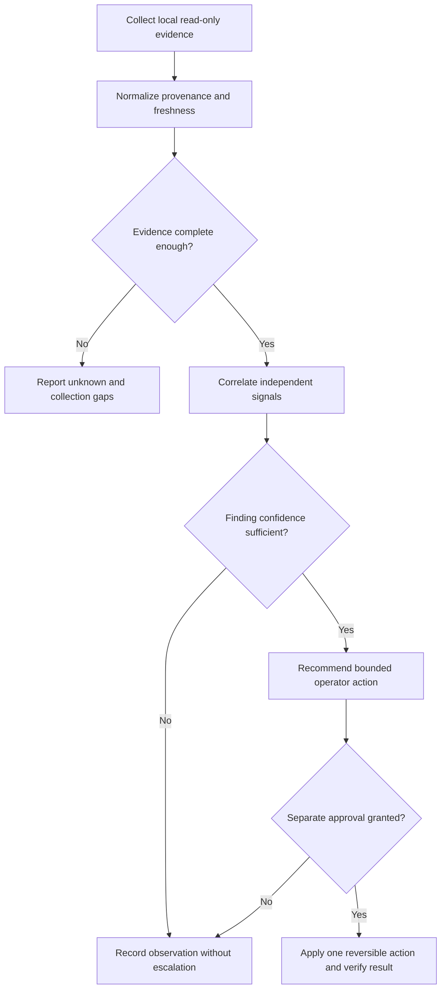

# Local Network Guard Evidence and Bounded Response

## Evidence source

This public case study is informed by the verified working/save-state lineage of
**Gateway AI Network Guard v1.6.3**, with v1.6.2 retained as the immediate
rollback. The private evidence includes an exact owner-only release, a live
Support Export20 from ALPHA, and user confirmation of the working state.

The private system remains independent on each computer. Computer recognition
is advisory only and does not create ownership, handoff, lease, waiting,
write-fence, or launch restrictions.

## Showcase objective

A local network guard must distinguish observation from authority. It can
collect evidence, rank anomalies, explain uncertainty, and recommend bounded
next steps without silently becoming a firewall controller, remote-management
agent, or cross-computer lock service.

## Reliability invariants

- Collection is read-only unless a separate action is explicitly approved.
- Computer labels are informational and never determine ownership or permission.
- Missing telemetry produces an unknown state rather than a fabricated clean or
  compromised verdict.
- Findings require evidence freshness, source provenance, and confidence.
- A single noisy signal cannot trigger a destructive response.
- Recommended actions are bounded, reversible, and separated from observation.
- Support exports are redacted, capped, project-local, and reviewable before
  sharing.
- Repeated collection failures stop within a bounded retry policy.

## Synthetic scenarios

| Scenario | Required response |
| --- | --- |
| One telemetry source stops responding | Report the collection gap and lower confidence |
| A local service appears briefly and disappears | Preserve evidence; avoid automatic containment |
| Two sources disagree about the same connection | Mark the finding unresolved until stronger evidence exists |
| A recognized computer label is unavailable | Use generic defaults and continue independent operation |
| A collection command times out repeatedly | Stop within the retry budget and export diagnostics |
| An action would require administrator authority | Separate observation from the explicit approval path |
| A prior finding is no longer reproducible | Record the change; do not silently erase history |
| Redaction cannot prove a support item is safe | Exclude the item from the public export |

## Audit evidence

A reviewable finding records evidence source, collection time, freshness,
normalization result, confidence, correlated signals, missing inputs, decision,
recommended action, approval state, action result, and rollback evidence.

The public demonstration can use synthetic connection records and inert local
fixtures. It should prove that incomplete evidence remains visible, advisory
computer labels never become access controls, and no response occurs without a
separate approval boundary.

## Public boundary

This document contains no local address, host name, hardware address, device
identifier, firewall rule, port list, process inventory, credential, security
exception, exploit detail, private path, remote-control command, or active
containment implementation. It cannot scan a real network, modify a firewall,
stop a process, or administer another computer.

The private package, Support Export20, local topology, and operating evidence
remain owner-only. Public material is limited to reliability architecture and
synthetic scenarios.

## Limitations

This case study is not a security assessment, intrusion-detection product,
incident-response plan, or deployment guide. Any operational implementation
requires environment-specific threat modeling, permission review, native
Windows testing, endpoint-protection review, and operator approval.

Copyright © 2026 Gateway Information Group LLC. All rights reserved.
