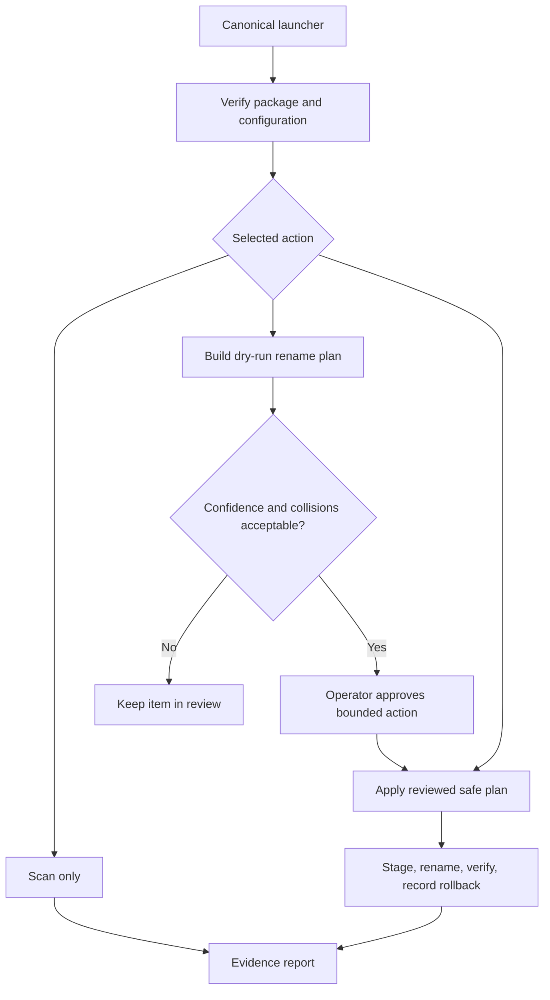

# MediaTaggerBot: One Active Launcher and Reviewable Rename Planning

## Evidence source

This public case study is informed by the **MediaTaggerBot v0.5.17 release
candidate**, build `MTB-0.5.17-B20260829-01`, which was assembled from the exact
v0.5.16 release lineage under the one-capability, one-active-launcher contract.
The candidate metadata records one canonical launcher, `MediaTaggerBot.bat`, and
retires the older `Start_MediaTaggerBot.bat` name from the active package.

That evidence supports a current consolidation study; it does not promote
v0.5.17 to a user-confirmed working release. The existing public repository and
private accepted package remain separate authorities until the exact candidate
package and native acceptance gates are complete.

## Showcase objective

A media-renaming utility can become difficult to trust when several launchers,
menus, aliases, and helper paths appear to perform the same operation. The
engineering objective is to expose one understandable control surface while
preserving distinct safety modes, review evidence, rollback, and any
compatibility boundary that has a proven consumer.

The public model separates discovery, proposed metadata, rename planning,
operator review, application, and rollback. It also separates human-facing
project names from package IDs, execution namespaces, stable entrypoints, and
historical aliases.

## Reliability invariants

- One canonical launcher is the only active human entrypoint.
- Each visible action maps to one authoritative backend implementation.
- A compatibility name remains only as a logic-free forwarder when a current
  shortcut, automation target, integration, or explicit requirement proves it
  is still needed.
- Retired or unknown action names fail explicitly rather than falling through
  to an older implementation.
- Scan-only and dry-run paths do not mutate media files.
- Rename plans record source identity, proposed destination, confidence,
  collision state, and the evidence used for the decision.
- Low-confidence or conflicting metadata remains in review rather than being
  applied automatically.
- A rename applies only inside the explicitly selected media root.
- Collision-safe staging and postcondition checks prevent silent overwrite or
  partial completion.
- Every applied change produces rollback evidence before the next item is
  committed.
- Project-local logs, state, diagnostics, and exports remain separate from the
  external media library.
- Package-integrity evidence is established once at the protected boundary and
  reused instead of launching redundant full-tree hash checks for each mode.

## Synthetic scenarios

| Scenario | Required response |
| --- | --- |
| Two root launchers appear to start the same menu | Keep the proven canonical launcher; retire or reduce the other name to a documented forwarder only when a current consumer exists |
| A removed historical action name is entered | Return an explicit unsupported-action result instead of invoking an old implementation |
| Two metadata sources disagree | Preserve both observations, lower confidence, and require review |
| Proposed destination already exists | Stop or choose a deterministic collision-safe alternative; never overwrite silently |
| A media item changes after the plan is created | Reject the stale plan and rescan the item |
| An apply step succeeds but destination verification fails | Stop the batch, preserve rollback evidence, and report an ambiguous result |
| A user selects a path outside the configured media root | Refuse the mutation and leave the external path unchanged |
| Package identity is already proven at startup | Reuse the same-run evidence rather than running another full package hash merely to enter a read-only mode |

## Audit evidence

A reviewable record contains the package identity result, selected action,
source-media fingerprint, metadata observations, confidence, proposed
filename, collision decision, operator approval, staging result, postcondition,
rollback location, and final disposition.

A public demonstration can use generated placeholder files and synthetic
metadata. It should prove that only one launcher owns the action surface,
unsupported aliases fail clearly, dry-run remains non-mutating, and a failed
postcondition never becomes a reported success.

## Public boundary

This document contains no music or media file, private filename, artist or title
history, external media path, account data, credential, database, release ZIP,
support export, private package digest, machine identifier, or operational
source code. It cannot scan, tag, move, rename, or delete a real media library.

The private v0.5.17 candidate, v0.5.16 source baseline, accepted rollback
packages, and user media remain owner-only. The public material is limited to
launcher consolidation, action authority, review, mutation, verification, and
rollback design.

## Limitations

This is a reliability and project-structure case study, not a released media
manager. Metadata quality, supported formats, public database behavior, file
permissions, filesystem semantics, performance, rollback durability, and native
Windows acceptance require implementation-specific testing. A cleaner action
surface does not by itself qualify a newer package as known-good.

Copyright © 2026 Gateway Information Group LLC. All rights reserved.
