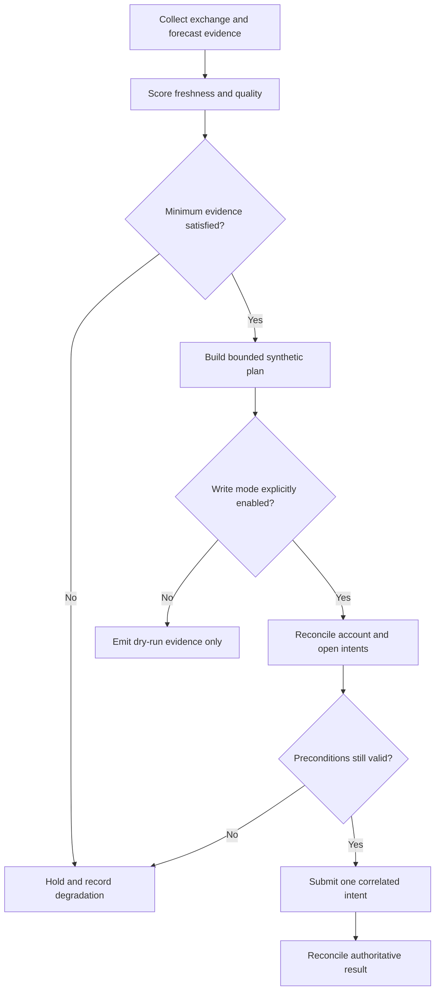

# Prediction-Market Data Quality and Write Guardrails

## Evidence source

This public case study is informed by the working/save-state lineage of the
**Kalshi Weather Ladder Relative-Value Maker v1.3.70**. The private evidence
records a complete package inventory, a complete runtime-identity inventory, a
large passing regression suite, a Windows-working save state, and no live orders
during acceptance. Earlier packages remain retained as historical rollback
evidence.

The public study does not contain market identifiers, weather-market selection
logic, forecast formulas, prices, quantities, credentials, or live-write code.

## Showcase objective

A weather-linked prediction controller combines several evidence systems that
can disagree or degrade independently: exchange state, forecast data, optional
specialized weather feeds, local calculations, time windows, and durable intent
state. The reliability challenge is to preserve a truthful decision when one
source is missing, delayed, stale, or inconsistent.

## Reliability invariants

- Live-write capability is a separate, explicit operating mode rather than a
  side effect of running the program.
- Dry-run and live planning share one decision path so simulated behavior does
  not silently diverge from production logic.
- Every data source carries freshness, provenance, and quality status.
- Optional specialized data may degrade gracefully only when the remaining
  evidence still meets a documented minimum-quality contract.
- Conflicting forecasts or market state produce a hold, not a guessed value.
- A ladder or portfolio plan is bounded by aggregate exposure and duplicate
  intent rules before any write is considered.
- Ambiguous exchange outcomes block additional writes until reconciliation.
- Restart recovery begins with current market and account observation.

## Synthetic scenarios

| Scenario | Required response |
| --- | --- |
| Optional forecast feed is unavailable | Continue only when the minimum-quality contract is still satisfied |
| Forecast sources disagree materially | Hold the affected plan and record the conflict |
| Market snapshot is stale | Refuse to calculate or submit a new action |
| Exchange response is ambiguous | Freeze writes for the intent and reconcile remote state |
| A process restarts with planned but unsent actions | Rebuild from fresh evidence rather than replaying memory |
| A process restarts with an uncertain submitted action | Restore the intent and reconcile before another write |
| Duplicate ladder positions are detected | Collapse or reject the duplicate plan before execution |
| Exposure evidence is incomplete | Fail closed and require operator review |

## Audit evidence

A reviewable record includes source timestamps, source quality states, degraded
inputs, forecast-consensus status, market-data freshness, operating mode,
planned action identity, exposure checks, remote correlation evidence, and the
reason the controller acted or withheld action.

The public demonstration should use synthetic weather observations and a local
exchange simulator. It should prove that optional-data degradation is visible,
dry-run and live planning cannot silently diverge, and ambiguous writes cannot
be retried blindly.

## Public boundary

This document contains no exchange credential, market ticker, geographic target,
forecast source endpoint, weather threshold, price, quantity, contract count,
ladder spacing, selection formula, profit objective, or live-write command. It
cannot authenticate, choose a market, calculate a real order, or submit a trade.

The private working package and its rollback packages remain owner-only. Public
material is limited to reliability architecture, synthetic scenarios, and
sanitized evidence categories.

## Limitations

This case study is not financial advice, weather advice, a prediction claim, a
strategy disclosure, or a deployment specification. Real markets and forecast
systems require venue-specific, legal, security, data-quality, and operational
review.

Copyright © 2026 Gateway Information Group LLC. All rights reserved.
