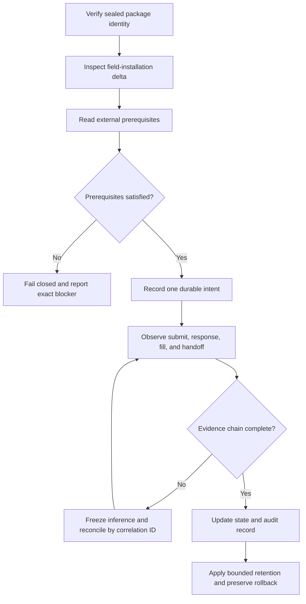

# Prediction-Market Save-State Reconciliation

## Evidence source

This public case study is informed by two owner-operated prediction-market
working/save-state lineages current as of August 25, 2026:

- **Kalshi 1¢ Buy Bot v69.67** as a Windows-working field baseline.
- **Kalshi 15-Minute 2¢ Sell Bot v41.61** as the current confirmed known-good
  rollback, with v41.62 retained as a separate diagnostic and release-control
  candidate.

The private evidence establishes coherent package identity, healthy launcher and
runtime behavior, managed-file verification, locked dependencies, bounded
contract controls, current market-data coverage, and explicit current/candidate
separation. It also preserves operational uncertainty: target-shard collateral
can be unavailable, attempt-response evidence can be incomplete, a field folder
can contain unmanifested overlay files even when the sealed package is clean,
and diagnostic retention can grow large enough to affect export and disk
behavior.

This showcase publishes the save-state and evidence-governance model only. It
does not publish credentials, market identifiers, account or shard balances,
prices, quantities, strategy logic, private performance data, or live-write
code.

## Showcase objective

A working save state is not merely the newest folder that launches. It is a
specific package whose identity, runtime behavior, external preconditions, and
evidence quality are understood well enough to preserve as a rollback.

The reliability problem is to distinguish:

1. a verified package from a mixed field installation;
2. a healthy runtime from an unavailable external prerequisite;
3. a submitted intent from an accepted response and a fill;
4. a diagnostic gap from a strategy result;
5. a working baseline from a candidate that still needs native acceptance.

## Reliability invariants

- The sealed package remains the release authority even when the working folder
  contains additional unmanifested files.
- External prerequisites such as shard-specific collateral are observed before
  a write and never repaired through an implicit transfer.
- Every submit attempt, accepted response, fill, and downstream handoff shares a
  durable correlation identity.
- An incomplete evidence window cannot be used to infer fill rate,
  profitability, or universal failure.
- Candidate diagnostics or release-control fixes do not replace the current
  known-good rollback until their native gates pass.
- Mixed-installation cleanup begins with a reversible preview and exact
  classification; working files are not deleted by resemblance.
- Log and diagnostic retention are bounded before they threaten disk,
  responsiveness, or support-export latency.
- Weak or partial performance evidence keeps dynamic strategy influence
  disabled or shadow-only.
- Current platform preconditions and package identity are reported separately.
- A working baseline can remain valid even while an external precondition
  correctly blocks new actions.

## Synthetic scenarios

| Scenario | Required response |
| --- | --- |
| Sealed package verifies but the field folder contains extra files | Preserve the sealed authority; classify extras before any cleanup |
| Target platform shard lacks usable collateral | Block the write and show the precondition; do not transfer automatically |
| Submit records exist but response records are absent | Treat the window as incomplete and reconcile by durable correlation ID |
| Broader history contradicts the newest evidence window | Preserve both scopes and prohibit performance inference until joined |
| A diagnostic candidate exists beside a confirmed rollback | Keep the rollback current until native candidate acceptance passes |
| Logs consume excessive space | Preview bounded retention, preserve required evidence, then prune reversibly |
| Runtime is healthy but no action can execute | Report healthy runtime and blocked external prerequisite as separate states |
| Performance evidence is partial or statistically weak | Keep strategy changes shadow-only |
| Cleanup tool mistakes a read-only support helper for a duplicate launcher | Correct the inventory classification; do not delete the helper |
| Field folder was updated by overlay extraction | Recommend a fresh-folder install for the next release |

## Audit evidence

A save-state record should identify the exact sealed package, current known-good
and candidate relationship, runtime identity result, field-installation delta,
external prerequisite state, correlation coverage from intent through outcome,
diagnostic-retention status, evidence-completeness limits, and the reason the
baseline was preserved or withheld.

A public demonstration can use synthetic exchange shards, local intent records,
partial response windows, simulated fills, overlay files, and oversized
diagnostic fixtures. It should prove that package truth, runtime health,
platform readiness, and performance evidence remain separate.

## Public boundary

This document contains no exchange credential, account identifier, market
ticker, shard identifier, balance, price, quantity, contract count, strategy
formula, performance statistic, route setting, or live-write command. It cannot
authenticate, fund an account, select a market, calculate an order, submit a
trade, or manage funds.

The private working and candidate packages remain owner-only. Public material is
limited to reliability architecture, synthetic scenarios, and sanitized
evidence categories.

## Limitations

This case study is not financial advice, a trading strategy, a performance
claim, or a deployment guide. It does not establish that any external
prerequisite is currently satisfied or that a private package is profitable.

Copyright © 2026 Gateway Information Group LLC. All rights reserved.
