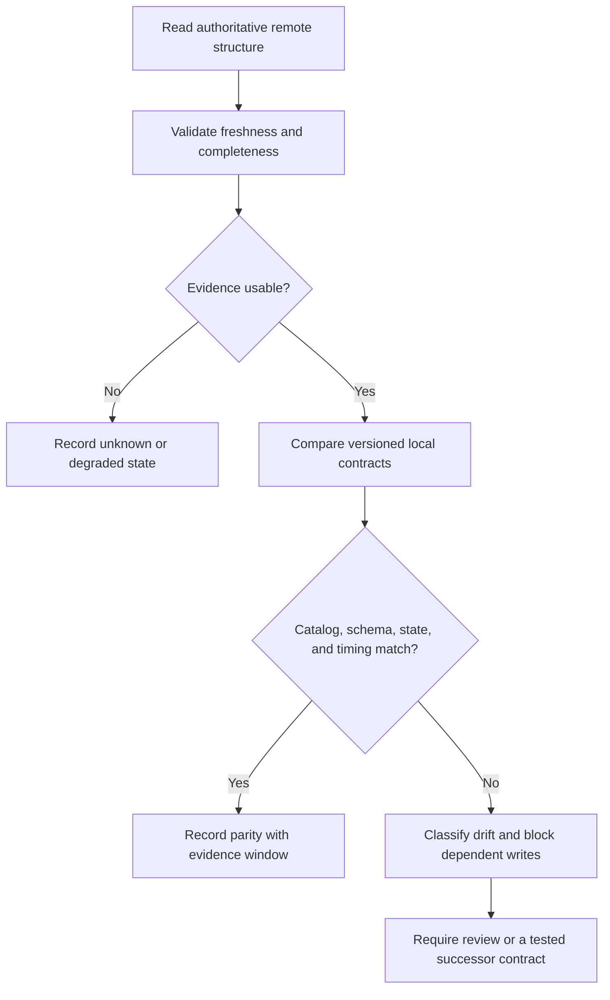

# Prediction-Market Structural Parity Under API Drift

## Evidence source

This public case study is informed by the **Kalshi Structural Parity Bot
v1.20.17** folder-declared working save state and the separately retained
v1.20.18 candidate. The available evidence includes exact package identities,
checksum companions, a bounded support export, and lifecycle records.

The classification matters: the baseline is folder-declared working state, not
a user-confirmed native Windows or live-financial acceptance result. The public
study preserves that distinction rather than upgrading the evidence label.

## Showcase objective

The engineering problem is how to detect when a local model of a remote market
surface has drifted from the authoritative platform without exposing strategy,
submitting an action, or treating one partial observation as proof that the
whole structure is correct.

Structural parity is divided into catalog, schema, state, timing, and evidence
contracts. Each contract can be current, degraded, mismatched, unknown, or
unsupported.

## Reliability invariants

- Remote read-only state is authoritative for the observed surface.
- Local expected structure is versioned and never silently rewritten from one
  sample.
- Missing fields, new fields, type changes, and semantic conflicts are reported
  separately.
- Freshness and completeness are evaluated before parity.
- One matching observation cannot clear a previously unresolved mismatch.
- Candidate package evidence does not replace the working baseline without its
  own acceptance result.
- An ambiguous or incomplete result blocks any dependent live-write decision.
- Repeated observations are bounded and retain the first and latest evidence.
- Support exports exclude credentials, account data, private configuration, and
  strategy values.
- Folder sharing or permission risk is tracked separately from runtime parity.

## Synthetic scenarios

| Scenario | Required response |
| --- | --- |
| A previously required field disappears | Record a schema mismatch and block dependent decisions |
| A new optional field appears | Record additive drift without rewriting the local contract automatically |
| Field type changes while the name remains | Treat it as incompatible until reviewed |
| Remote snapshot is stale | Report degraded evidence rather than parity failure |
| Two endpoints disagree about the same object | Mark the state unresolved and retain both observations |
| Candidate package reports parity but the working baseline reports a mismatch | Preserve both lifecycle results; do not promote the candidate automatically |
| One retry matches after several mismatches | Require a stable evidence window before clearing the incident |
| Folder permissions are broader than intended | Record a sharing-risk issue independently of runtime structure |

## Audit evidence

A reviewable parity record contains contract version, observation time,
freshness, completeness, source class, expected field set, observed field set,
type and semantic differences, retry window, lifecycle authority, dependent
write status, and the reason the result is parity, drift, degraded, unknown, or
unsupported.

A public demonstration can use deterministic synthetic schemas and snapshots
that add, remove, rename, or change fields. It should prove that drift is
classified precisely and that incomplete evidence cannot produce a green
result.

## Public boundary

This document contains no exchange credential, service endpoint, account data,
market identifier, symbol, price, quantity, fee, strategy rule, selection
formula, order command, private package digest, Drive link, or live-write
implementation. It cannot authenticate, discover a real market, calculate a
trade, submit an order, or manage funds.

The private working and candidate packages remain owner-only. The public
material is limited to structural contracts, evidence quality, lifecycle
separation, drift classification, and fail-closed dependency control.

## Limitations

This case study is not financial advice, a market strategy, a platform
specification, or proof of native Windows or live-financial acceptance. Remote
platforms can change, and any operational implementation requires current
platform documentation, authenticated read-only validation, legal and security
review, native acceptance, and separately approved live-write controls.

Copyright © 2026 Gateway Information Group LLC. All rights reserved.
