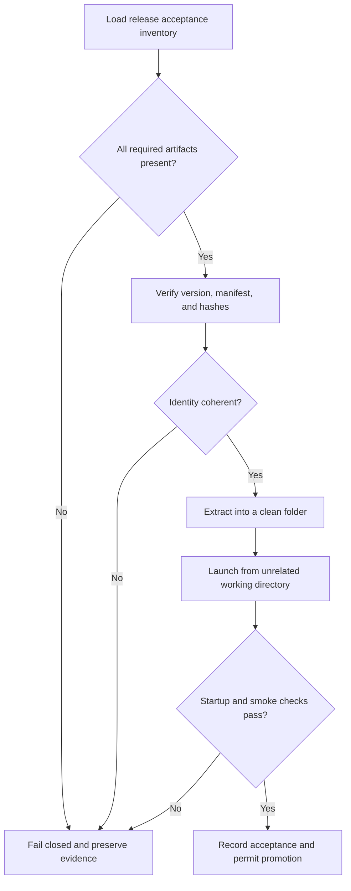

# Game Release Acceptance and Fail-Closed Promotion

## Evidence source

This public case study is informed by the **MUDD Game Development — Second
Chances v0.68.4** HUD and quest-polish save-state candidate. An independent
acceptance run failed closed because a required Windows player artifact was not
present in the verification environment.

That result is valuable evidence. It means the candidate was not silently
promoted, reconstructed from a different file, or described as accepted merely
because related source and save-state material existed. The candidate and its
prior rollback evidence remain distinct.

This showcase publishes the release-acceptance model only. It does not publish
game source, executables, art, music, story text, private paths, package hashes,
or project-specific build commands.

## Showcase objective

A release can be internally coherent and still be incomplete as a deliverable.
The acceptance problem is to prove that every required artifact exists, belongs
to the same release, launches from a clean extraction, and produces enough
evidence to justify promotion.

The public design separates:

1. source completeness;
2. package completeness;
3. artifact identity;
4. clean-extraction launch behavior;
5. acceptance evidence;
6. promotion authority.

## Reliability invariants

- Every required release artifact is named in one acceptance inventory.
- A missing required artifact fails the release before launch claims are made.
- Source, development package, player package, and handoff package cannot
  substitute for one another.
- A matching version label is not enough; identity and manifest evidence must
  agree.
- Acceptance runs use a clean extraction and an unrelated working directory.
- Generated files, logs, saves, and caches do not become package-managed source.
- Failure evidence is retained without overwriting the candidate or rollback.
- No substitute artifact is rebuilt or relabeled merely to satisfy a missing
  gate.
- Promotion occurs only after all required gates pass on the exact candidate.

## Synthetic scenarios

| Scenario | Required response |
| --- | --- |
| Windows player archive is missing | Fail before launch and name the missing artifact |
| Source and player archives report different builds | Reject the mixed release |
| A developer package launches but the player package is absent | Do not substitute the developer package for player acceptance |
| Generated logs appear in the source tree | Exclude them from managed source and rerun identity checks |
| Candidate launches only from its original folder | Fail portability acceptance |
| A prior rollback exists and the candidate fails | Preserve both; keep the rollback authoritative |
| A handoff ZIP contains only documentation | Do not describe it as the runnable release |
| The expected artifact cannot be recovered | Record not-found status; do not reconstruct a fake equivalent |
| All gates pass on an exact candidate | Publish with rollback, manifest, and acceptance receipt |

## Audit evidence

A useful acceptance record contains the required-artifact inventory, version and
build agreement, manifest and integrity result, extraction path class,
entrypoint result, smoke-test result, generated-file delta, acceptance status,
missing or blocked gates, rollback anchor, and final promotion decision.

A public demonstration can use inert placeholder archives and intentionally omit
one required package. The correct result is a deterministic failed-closed report,
not a partially successful release claim.

## Public boundary

This document contains no executable, game source, art asset, audio file,
manuscript text, save file, private path, package hash, launch command, or
platform credential. It cannot build, launch, patch, or distribute the private
game.

The scenario is synthetic and documentation-only. The private save-state
candidate and rollback packages remain owner-only.

## Limitations

A failed acceptance run does not prove the underlying game source is defective.
It proves only that the required release evidence was incomplete in that
verification context. A later exact candidate may pass after the missing
artifact is recovered and all gates are rerun.

Copyright © 2026 Gateway Information Group LLC. All rights reserved.
