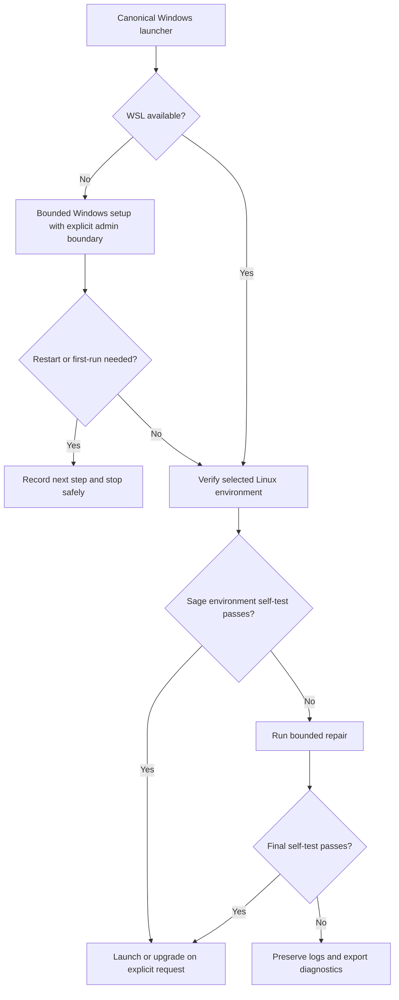

# SageMath WSL Manager: Cross-Boundary Installation and Recovery

## Evidence source

This public case study is informed by the owner-only **SageMath WSL Manager
v1.3.2** registered final package and its retained launcher source. The reviewed
lineage uses one Windows BAT entrypoint to install, launch, upgrade, inspect, and
export diagnostics for a SageMath environment hosted through Windows Subsystem
for Linux.

The retained source shows one visible manager, a dry-run path, explicit
administrator admission for the Windows feature/install stage, WSL readiness
checks, an isolated Linux-side installer payload, stale-lock handling, bounded
artifact retention, runtime self-tests, and a redacted diagnostic archive. The
Drive registry confirms the package identity, but its dependency and runtime
acceptance were **not rerun in the current portfolio review**. That distinction
is preserved here: registration is provenance, not fresh field acceptance.

## Showcase objective

Cross-boundary installation is difficult because Windows, WSL, a Linux
distribution, package-management state, user initialization, reboot state, and
the application environment can each be individually healthy while the overall
workflow is incomplete.

A reliable manager therefore needs to know which boundary owns the next action,
which evidence proves that boundary is ready, and when recovery must stop rather
than repeatedly reinstalling components.

## Reliability invariants

- One human entrypoint owns install, repair, launch, upgrade, status, and support
  routing.
- Readiness is established in stages: Windows capability, usable WSL runtime,
  selected distribution, initialized Linux user environment, package manager,
  SageMath environment, then application self-test.
- Administrator elevation is requested only for the Windows operation that
  requires it; ordinary launch and status work do not inherit that authority.
- A reboot request becomes explicit state rather than an unexplained failed
  installation.
- An existing SageMath environment is tested before reinstall or upgrade.
- Failed self-test may trigger a bounded repair path; a healthy environment is
  not rebuilt merely because install was selected again.
- Windows-side and Linux-side installation locks have bounded stale recovery so
  abandoned work cannot block the project forever.
- Generated installer payloads, logs, diagnostics, and exports are retained
  within bounded storage classes and pruned by policy.
- Diagnostics are gathered separately from installation behavior and redact
  local identity and address evidence before sharing.
- Archive creation uses temporary staging and finalization rather than treating
  a partial ZIP as a successful support export.
- A public or future release must pin or independently verify externally
  downloaded installer material rather than trusting a moving “latest” artifact
  solely because transport succeeded.
- A registered package remains distinct from a freshly accepted Windows/Norton
  release; version numbers do not collapse those evidence classes.

## Synthetic scenarios

| Scenario | Required response |
| --- | --- |
| WSL command exists but no usable Linux distribution is initialized | Explain the missing boundary and route to the bounded setup/first-run step instead of attempting the Sage install blindly |
| Windows reports that a restart is required | Persist the incomplete state, tell the operator what remains, and stop rather than treating the install as finished |
| An environment already exists and the Sage self-test passes | Reuse it for a normal install request; upgrade only when the upgrade action was explicitly selected |
| A prior installer lock exists but its owner is gone and the lock is stale | Remove only the proven stale lock and continue; do not delete unrelated state |
| A second active installer owns the same local target | Refuse the conflicting install and preserve the current operation |
| Package-manager download or install fails repeatedly | Stop after the bounded retry path and retain the failure evidence |
| Final command returns success but the Sage self-test fails | Report installation failure; command exit alone is not acceptance evidence |
| Diagnostic collection cannot read one optional source | Record the omission and still produce a bounded support set when minimum evidence remains available |
| Archive staging succeeds but final ZIP validation fails | Keep the evidence folder and report export failure rather than publishing a partial archive |
| A moving upstream installer is fetched successfully | Treat transport success separately from artifact provenance; a future public release should pin or verify the downloaded artifact |

## Audit evidence

A reviewable installation record can contain manager version, selected action,
Windows capability state, WSL availability, distribution-selection result,
first-run readiness, elevation boundary, reboot state, lock outcome, environment
existence, application self-test result, repair or upgrade result, bounded retry
outcome, and support-export status.

The useful outcome is not “the installer ran.” It is a reconstructed chain of
evidence showing which boundary was ready, which action changed state, and
whether the final SageMath self-test passed.

## Public boundary

This document contains no private package byte, local username or path, machine
identifier, distribution account, network address, diagnostic archive, package
digest, or administrator command sequence copied from the owner environment. It
cannot enable WSL, install a Linux distribution, download Miniforge, modify a
shell profile, install SageMath, or change a real computer.

The private v1.3.2 package remains owner-only. Its registry entry establishes
retained provenance; it does not by itself establish fresh dependency, Windows,
endpoint-protection, or current upstream-installer acceptance.

## Limitations

This is a reliability case study, not an installer or current release claim.
Real acceptance must re-evaluate supported Windows and WSL versions,
distribution behavior, package-manager compatibility, upstream installer
provenance, privileges, reboot and first-run behavior, path containment,
redaction, archive integrity, endpoint protection, and clean-extraction launch.

The historical launcher also contains fallback-output and moving-upstream
choices that should be reviewed against the current project-local and
reproducible-release framework before any new public source package is created.

Copyright © 2026 Gateway Information Group LLC. All rights reserved.
