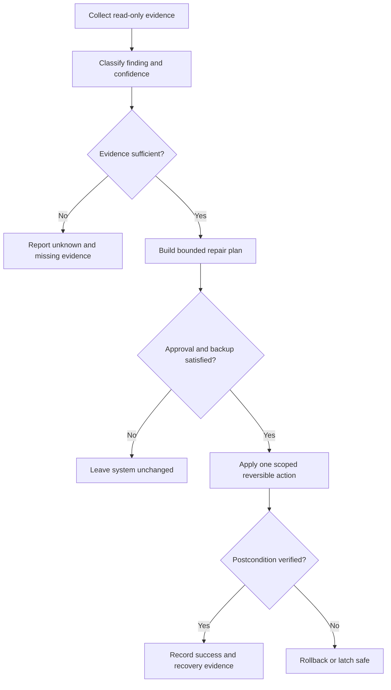

# Windows Repair Planning and Reversible Remediation

## Evidence source

This public case study is informed by the **PC Improve v55.33.0 consolidation
candidate**, built from an exact v55.32.0 source baseline. The current inventory
evidence records a reduction from 91 to 90 retained files, six distinct root BAT
actions, no exact duplicate-content groups before manifest finalization, and the
retirement of the unproven `00_START_HERE.bat` launcher after package-wide
reference mapping.

The candidate also removes a redundant package-integrity collection path: the
protected startup boundary establishes managed-source integrity once, then
later read-only workflows reuse that same-run evidence instead of launching
additional full-tree hash processes. The previously accepted v55.29.4 working
baseline and v55.29.3 launch/identity rollback remain preserved; a cleaner
v55.33.0 package is not treated as known-good solely because it is newer.

The private program, diagnostic evidence, machine context, repair commands, and
package contents remain owner-only. This study publishes the governance model
for safe repair and consolidation, not the operational repair package.

## Showcase objective

The engineering problem is how to move from system evidence to a useful repair
without turning a diagnostic utility into an unbounded administrator, deleting
user data, weakening security controls, or losing the ability to explain and
reverse the change.

A second problem is structural: several launchers, menus, aliases, or collectors
can quietly become competing implementations of the same capability. The public
design therefore separates observation, recommendation, approval, execution,
verification, rollback, and action-surface ownership into distinct states.

## Reliability invariants

- Discovery is read-only and failure-isolated.
- One filename represents each distinct user action; similar names do not remain
  active without a proven consumer or material safety boundary.
- The action registry is the authoritative map from visible action to backend.
- Retired or unknown actions fail explicitly instead of invoking historical code.
- Integrity is established at the protected execution boundary and reused; a
  later collector does not repeat the same full package hash without a separate
  diagnostic purpose.
- A recommendation identifies the evidence, expected benefit, risk, required
  authority, backup, and rollback before execution.
- Administrator, destructive, credential, security, and bulk-write actions do
  not occur as a side effect of scanning.
- Security protections are never disabled to make a repair appear successful.
- Each approved repair is bounded to an explicit target and expected effect.
- User-created files and unknown state are preserved by default.
- Writes use temporary staging and atomic replacement when practical.
- Verification checks the intended postcondition rather than only the command's
  exit code.
- A failed or ambiguous verification triggers rollback or a latched stop.
- Repeated repair attempts are bounded and cannot create an endless loop.
- Support exports are redacted, project-local, integrity-tested, and limited to
  high-value evidence.

## Synthetic scenarios

| Scenario | Required response |
| --- | --- |
| Two root launchers map to the same backend | Retain the proven canonical action; retire the duplicate or reduce it to a documented forwarder only when a current consumer exists |
| A historical action alias is no longer mapped | Return an explicit unsupported-action result instead of routing into old code |
| A collector would repeat startup package verification | Reuse the same-run integrity receipt unless the user requested an independent diagnostic |
| A collector fails but other checks pass | Report the gap; do not infer the missing state |
| Recommended change needs administrator authority | Present the plan and approval boundary before any write |
| A target file differs from the expected known state | Stop and preserve it rather than overwriting uncertainty |
| A repair command exits successfully but the postcondition is absent | Treat the repair as failed and invoke rollback policy |
| Rollback evidence is incomplete | Do not begin the repair |
| A second repair instance starts | Permit observation, but block conflicting writes to the same target |
| A security product blocks the action | Preserve the protection and report the block |
| The same failure returns after the retry budget | Latch safe and require operator review |

## Audit evidence

A reviewable repair record contains the package and action-registry identity,
selected action, reused or independently collected integrity evidence, evidence
source, collection result, finding confidence, target identity, planned change,
required authority, backup status, approval state, precondition, action result,
postcondition, rollback result, and final operator-visible status.

A public demonstration can use a synthetic filesystem and inert configuration
fixtures. It should prove that scans remain read-only, duplicate actions cannot
become competing implementations, unknown files are preserved, approvals are
explicit, and failed postconditions do not become false successes.

## Public boundary

This document contains no repair executable, administrator command, registry
location, service name, scheduled task, security exclusion, private diagnostic,
machine identifier, user path, system inventory, credential, package digest, or
package file. It cannot modify Windows, change endpoint protection, repair a
computer, or remove user data.

The private v55.33.0 candidate, accepted v55.29.4 baseline, v55.29.3 rollback,
and intervening source packages remain owner-only. The public material is
limited to action consolidation, evidence, planning, approval, bounded
execution, verification, and recovery architecture.

## Limitations

This case study is not a maintenance script, security product, diagnostic
finding, or recommendation for a particular computer. Real repairs require
machine-specific evidence, backup validation, native Windows testing, endpoint-
protection review, least-privilege execution, and operator approval. A leaner
file and launcher surface improves reviewability but does not replace exact
package and field acceptance.

Copyright © 2026 Gateway Information Group LLC. All rights reserved.
