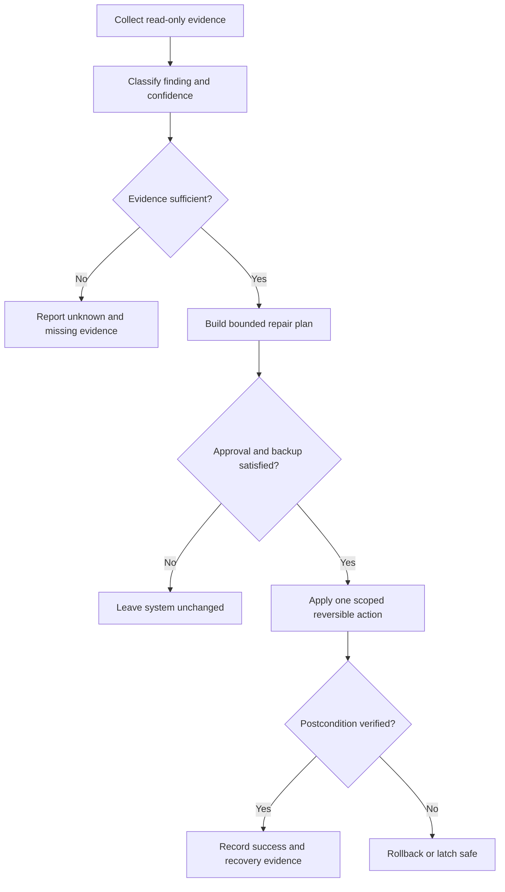

# Windows Repair Planning and Reversible Remediation

## Evidence source

This public case study is informed by the verified working/save-state lineage of
**PC Improve v55.29.4**, with v55.29.3 retained as a launch and identity rollback
savepoint. The private evidence records deterministic package verification,
large regression inventories, current known-good status, and an explicit hold
on unresolved shared-writer risk.

The private program, diagnostic evidence, machine context, and repair commands
remain owner-only. This study publishes the governance model for safe repair,
not the operational repair package.

## Showcase objective

The engineering problem is how to move from system evidence to a useful repair
without turning a diagnostic utility into an unbounded administrator, deleting
user data, weakening security controls, or losing the ability to explain and
reverse the change.

The public design separates observation, recommendation, approval, execution,
verification, and rollback into distinct states.

## Reliability invariants

- Discovery is read-only and failure-isolated.
- A recommendation identifies the evidence, expected benefit, risk, required
  authority, backup, and rollback before execution.
- Administrator, destructive, credential, security, and bulk-write actions do
  not occur as a side effect of scanning.
- Security protections are never disabled to make a repair appear successful.
- Each approved repair is bounded to an explicit target and expected effect.
- User-created files and unknown state are preserved by default.
- Writes use temporary staging and atomic replacement when practical.
- Verification checks the intended postcondition rather than only the command's
  exit code.
- A failed or ambiguous verification triggers rollback or a latched stop.
- Repeated repair attempts are bounded and cannot create an endless loop.
- Support exports are redacted, project-local, integrity-tested, and limited to
  high-value evidence.

## Synthetic scenarios

| Scenario | Required response |
| --- | --- |
| A collector fails but other checks pass | Report the gap; do not infer the missing state |
| Recommended change needs administrator authority | Present the plan and approval boundary before any write |
| A target file differs from the expected known state | Stop and preserve it rather than overwriting uncertainty |
| A repair command exits successfully but the postcondition is absent | Treat the repair as failed and invoke rollback policy |
| Rollback evidence is incomplete | Do not begin the repair |
| A second repair instance starts | Permit observation, but block conflicting writes to the same target |
| A security product blocks the action | Preserve the protection and report the block |
| The same failure returns after the retry budget | Latch safe and require operator review |

## Audit evidence

A reviewable repair record contains the evidence source, collection result,
finding confidence, target identity, planned change, required authority, backup
status, approval state, precondition, action result, postcondition, rollback
result, and final operator-visible status.

A public demonstration can use a synthetic filesystem and inert configuration
fixtures. It should prove that scans remain read-only, unknown files are
preserved, approvals are explicit, and failed postconditions do not become false
successes.

## Public boundary

This document contains no repair executable, administrator command, registry
location, service name, scheduled task, security exclusion, private diagnostic,
machine identifier, user path, system inventory, credential, or package file.
It cannot modify Windows, change endpoint protection, repair a computer, or
remove user data.

The private PC Improve package and its rollback remain owner-only. The public
material is limited to evidence, planning, approval, bounded execution,
verification, and recovery architecture.

## Limitations

This case study is not a maintenance script, security product, diagnostic
finding, or recommendation for a particular computer. Real repairs require
machine-specific evidence, backup validation, native Windows testing, endpoint-
protection review, least-privilege execution, and operator approval.

Copyright © 2026 Gateway Information Group LLC. All rights reserved.
